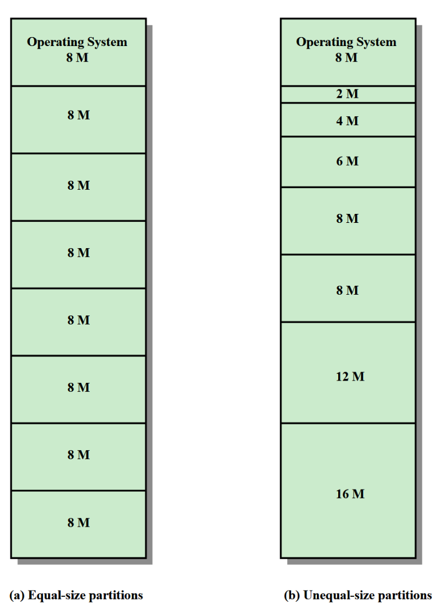
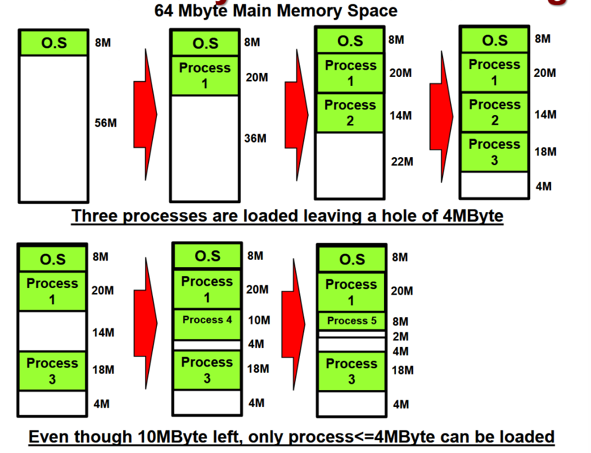
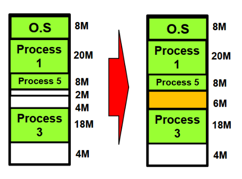
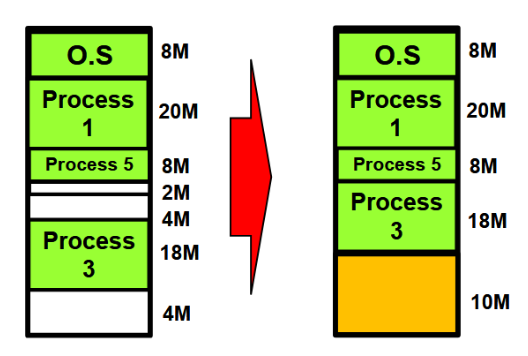
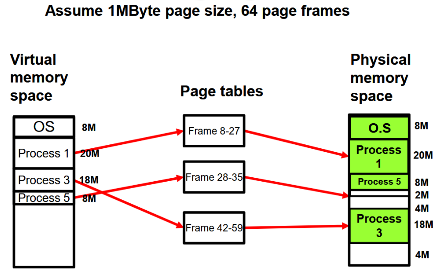
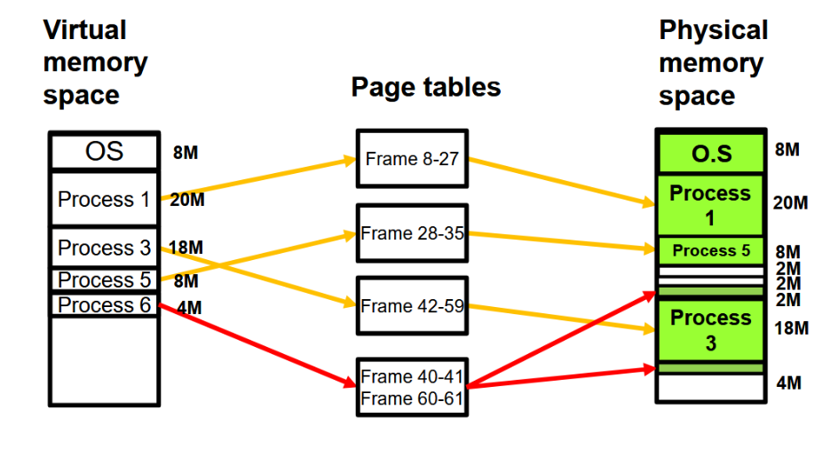
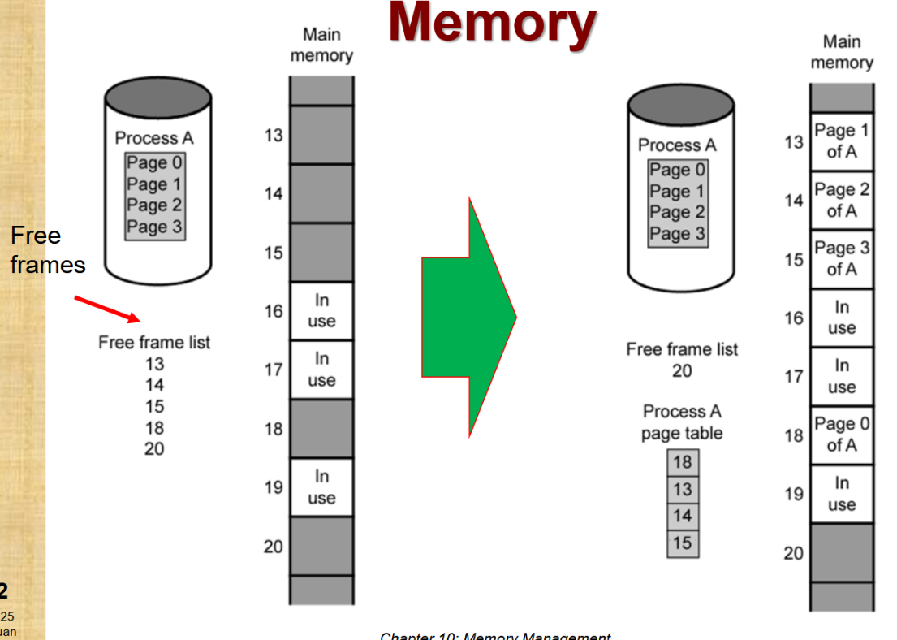
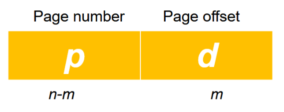
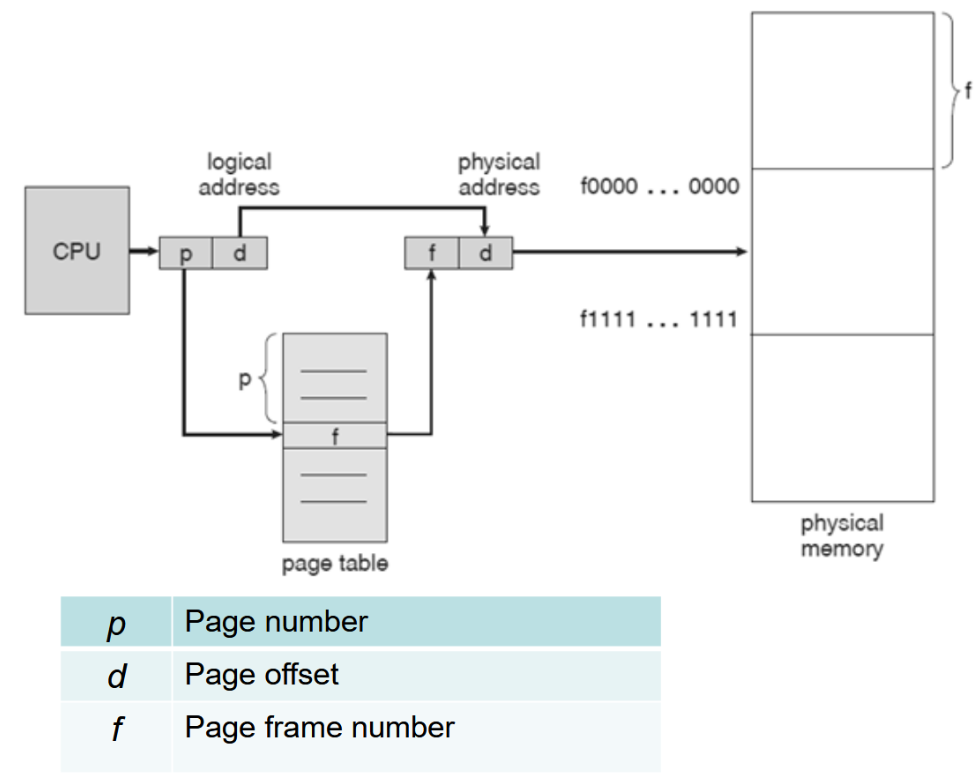
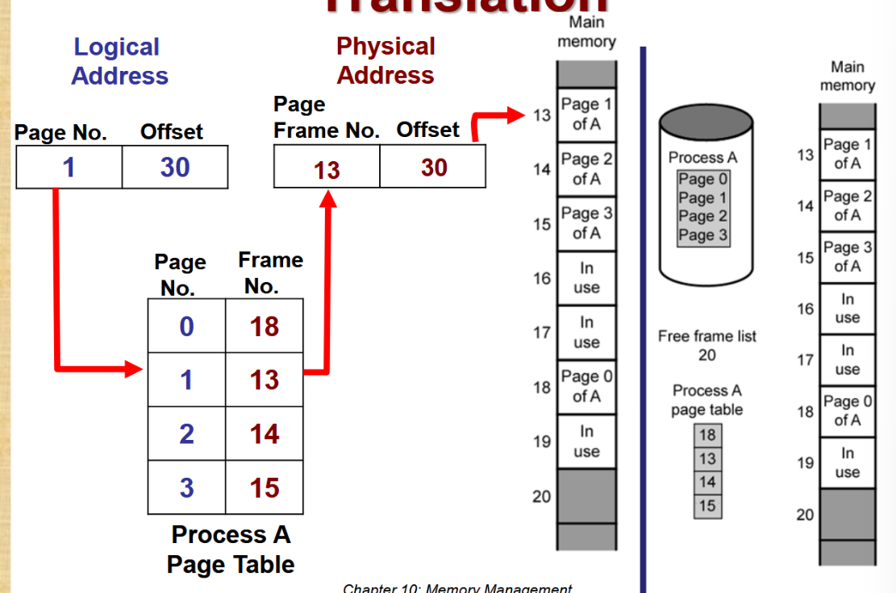

# Uni- and Multi-program Systems
2 types of program that are stored in memory:
- OS - for the management of computer resources (CPU, memory, I/O)
- Applications program (user ran), ran on top of operating system

## Uni-program System
means that, can only execute 1 program at a time
- Computer must complete execution of current before executing another

Inefficient:
- I/O operations required by a program can be slow compared to CPU execution

**Lack of parallel processing support** for applications like
- Computer graphics - process all pixels simultaneously
- Bioinformatics - massive parallel sequencing of genes

## Multi-program System
- Multiple programs can be executed in parallel

Single-core processor:  
Programs can be time-interleaved
- Divide CPU time into slots and allocate them to different programs when they run at the same time

Multi-core processor:  
Programs can be space-interleaved
- Allocate programs to different cores so they actually run at the same time

Challenges:
- Program scheduling: how CPU time is evenly allocated to different programs
- Memory management: how multiple programs are store in memory
- Protection and isolation (memory protection, process isolation)
- Many other challenges


# Swapping and Partitioning
## Swapping
is the process of fetching the program from secondary memory (HDD) to main memory (RAM), then executing it.

### A System Process
It includes:
- Program code: executable instructions
- Stack: Local variables and function call information
- Data section: global and static variables
- Heap: dynamically allocated memory

### Long-term Queue
- Queue of process requests (new processes requests)
- Stored on disk

### Intermediate Queue
- Queue of existing processes
- Temporary storage for processes removed from main memory
- Allows efficient memory management
- Enables process suspension and resumption
- Helps system resources during high load

### Process of swapping
- If a process completes, it is moved out of main memory
- If a process in memory is **not ready** (I/O is blocked) ***
	- Swap the blocked process to intermediate queue
	- Swap in a **ready or new** process
- Swapping is an I/O operation
	- Involves significant disk read/write time
	- Introduces performance overhead

## Partitioning
Splitting memory into sections for convenient allocation to processes (including OS)

2 methods: 
1. Fixed partition
2. Dynamic partition

### Fixed partition
  
Size of each partition is fixed
- May or may not be equal size
- Process is fitted into smallest partition (best fit)
- Wasted memory space :(

### Dynamic partition
A process is placed into main memory with exact required size

#### Hole Problem
  
- Example shows a "hole" left at the end of memory
- If a process is swapped out and new process is swapped in:
- $Size_{new} \lt Size_{old}$ 
- A new hole will be created :(

Phenomenon known as external fragmentation

#### Solutions:
##### Coalesce
- Combine **adjacent** holes into 1 larger hole
- 
- A process of 6M can be loaded instead of 4M

##### Compaction
- Occasionally, go through memory and move all holes into 1 free block
- 
- A process of 10M can be loaded instead of 6M
- Memory relocation (more resource-intensive)

# Paging
Overcome problem of "holes" in partitioning, eliminate contiguous memory requirement

Programs/Processes divided into ***equal sized small chunks***
- known as <font color="#00b0f0">Pages</font>
- Virtual Memory
	- Belongs to Program/Process
	- Matches Page Frame size
	- Logical memory division

Main memory is also divided into ***equal sized small chunks***
- known as <font color="#00b0f0">Frames / Page Frames</font>
- Physical Memory
	- Belongs to physical RAM
	- Matches page size
	- Physical memory allocation

Page size: Size of each page  
Number of page frames: $\frac{\text{Total memory capacity}}{\text{Page size}}$

- Sufficient number of page frames will be allocated to the process
- OS maintains the list of free page frames
- Process does not require contiguous page frames (in physical memory)
	- Will need a <font color="#00b0f0">Page Table</font> to keep track of memory frames allocated
	- Page table: ***maps logical pages to physical frames***
		- Converts logical address to physical addresses

Paging example:
- 
	- Frame 8-27: 20MByte allocated to process 1
	- Frame 28-35: 8Mbyte allocated to process 5
	- Frame 42-59: 18MByte allocated to process 3
- 
	- Introduce a new process of 4MBytes
	- Split into multiple frames: Frame 40-41, Frame 60-61, each 2 Mbyte

Another example:
- 
	- Allocate 4 required pages to 4 free page frames

## Relocation of Codes
No guarantee that a process will be loaded into same main memory during swapping

User code will use **logical addresses** whilst CPU executes from actual **physical addresses**
- Logical address (Virtual): a <font color="#00b0f0">location relative to the beginning of the program (program's start)</font>
	- Will be consistent across different memory loadings
- Physical address: actual location in memory

Translation between these addresses is done by **Memory Management Unit (MMU)** of the OS

## Address Translation Scheme
EACH logical address has 2 parts:
- Page number: 
	- used as index in a page table
	- helps locate corresponding frame in physical memory
- Page offset: 
	- The **RELATIVE** address **within a page**
	- Remains constant 
	- Determines the exact position within the page/frame

- Logical Address Space (<font color="#00b0f0">number of total addresses, not size</font>): 2<sup>n</sup>
- Page Size: 2<sup>m</sup>

If n = 16 bits and m = 10 bits,
- then each page contains 2<sup>10</sup> = 1024 items/addresses
- and there are 2<sup>16-10</sup> = 64 total pages

Logical address space = 2<sup>16</sup> = 65536 = 64 pages $\times$ 1024 total addresses

Example:
- 
	- From logical to physical address
	- The page table will translate the page number to the page frame number
- 
	- The page table keeps track of the mappings

Example:
The logical address space contains 128Kbytes. The physical address space contains 64Kbytes. The page size is 2Kbytes. How many frames are there in this system?
- Page size = Frame size = 2Kbytes
- Physical frames: $64Kbytes \div 2Kbytes = 32\text{ frames}$
- Logical Pages: $128Kbytes \div 2Kbytes = 64 \text{ pages}$
Shows that swapping is most likely necessary  
Lecture:
```
Page size = 2 ^ (No. of page offset bits)
2Kbytes = 2 ^ 11 (11 = No. of page offset bits)

Virtual address space size = 2 ^ (No. of page number bits) * page size
128 Kbytes = 2 ^ 6 * 2Kbytes (6 = No. of page number bits)

Physical address space size = 2 ^ (No. of page frame bits) * page size
64 Kbytes = 2 ^ 5 * 2Kbytes (5 = No. of frame number bits)

No. of page table entries = No. of pages in the virtual address space
128 Kbytes / 2 Kbytes = 2 ^ 6 = 64 (64 = No. of page table entries)
```

