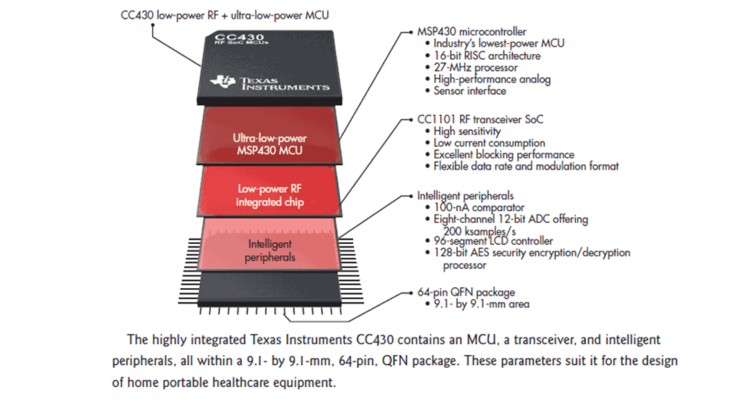
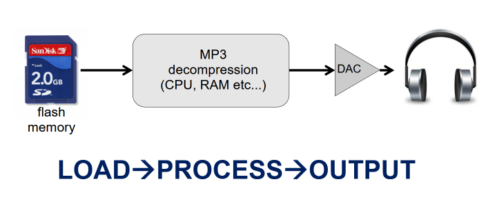
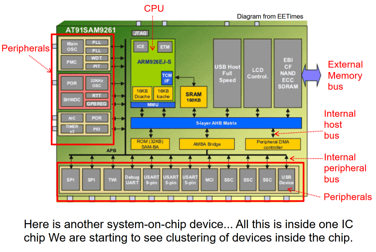
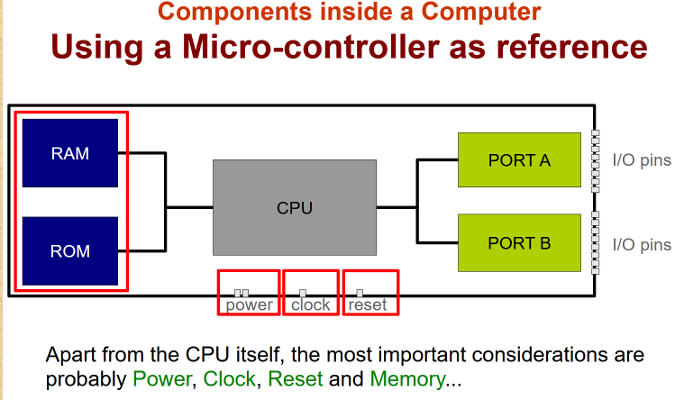
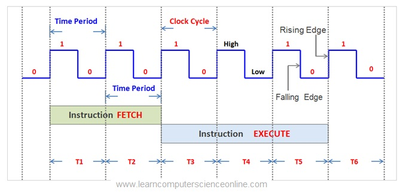
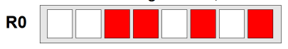
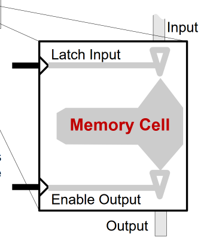
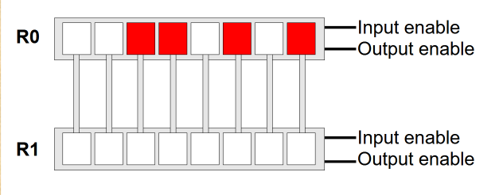
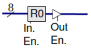

# History Lesson
## 1943 Bletchley Park, UK
Tommy Flowers, working with Alan Turing built **Colossus** as a code-breaking machine

## 1944, USA
ENIAC had a similar design to Colossus, and although it was only operational after Colossus

## Stored Program Concept
John Von Neumann proposed the stored program concept at Princeton University. Stored program computers can carry out many different tasks because it stores both data and instructions in the same memory, enabling general-purpose computing

## 1948, Manchester
The SSEM (Baby) was the first stored program computer (i.e. and architecture like a modern machine).

## 1953, Manchester
The transistor computer was ( as the name suggests) the worlds first transistor computer. Manchester was also the home of the world's first commercial computer, in 1951

## 1951, USA
MIT built the worlds first real-time computer

# Classes of Computers
## Embedded Microcomputer
Compact computers that use a single-chip (microcontroller) that contains the processing unit, memory and required peripheral support. Example: cellphone, thermometer, basic mouse

## Systems-on-Chip (SoC)
A microcontroller that has been integrated with other interface systems on a single chip is know as Systems-on-Chip

# Basic Operations and Requirements
A computer is simply a device that has 3 operations:
1. **Stores and retrieves** values/data
2. **Transforms** those values (aka compute)
3. **Transfers** those values from one place to another

Things that differ between computers are:
1. Where the values can be stored
2. What type of processing can be done
3. Where can the data be transferred from or to

Examples
- 
	- MP3 Player loads data from flash memory, and the CPU decompresses the MP3 data into audio samples, the audio samples are transferred to a digital-to-analogue converter

# Components inside a Computer
ARM SoC
- 
- Peripherals are interfaces that connect to the IC to provide additional functionality. Examples include: I/O interfaces (UART, SPI, USB), memory interfaces (dynamic random access memory), sensor interfaces (analog to digital converters, or digital to analog converters), power management (voltage regulators), communication protocols (ethernet MAC, WIFI, Bluetooth modules) 
	- The example shown are on-chip peripherals.
- An **internal host bus**, also known as a system bus, is a high-speed communication pathway that connects the CPU to other essential components. Example: PCIe only in SoC, AHCI
- An **external memory bus** is a communication pathway that connects the CPU to external memory, examples include DDR, SPI(for flash memory/SD cards).
- An **internal peripheral bus** is a communication pathway that connects peripherals within a system to the CPU

## The Clock

Modern computers are synchronous, which means that they only do stuff at **rising & falling edges**, making digital logic reliable. Generally, things closer to the core of the CPU will be clocked faster, things further away will clocked slower.

## The Reset Switch
Logic bits are stored as voltage in flip-flops, latches or as electronic charges in a capacitive cell. A reset signal is **crucial in giving a CPU a clean start**. It will clear all registers and RAM might get cleared, peripherals such as USB devices and cards are reset.
When Windows does a restart on the computer, it essentially just sets the program counter to 0 (which is not a clean start). The RAM contents are preserved meaning its useful for forensics.

## Memory 
Non-volatile memory
- retains its contents when the power is turned off (EEPROM, ROM)

Volatile memory
- gets wiped whenever the power goes off. (SRAM, DRAM, DDRAM)

Memory hierarchy:
- 

## Register-to Register Data Transfer

- Red represents a positive voltage, binary value of 00110101

- Whenever the input signal is triggered, the data in the input pin will be latched into the cell
- Whenever the output signal is triggered, the data stored in the cell will appear at the output

- 
	1. Enable the Output of R0
	2. Once voltage on the wires have stabilized, we trigger the R1 Input, keeping R0 output on
	3. Safely turn off R0 output

- Illustration: the data bus is 8 bits