# Approaches to Computing
## Programming in Hardware vs Software
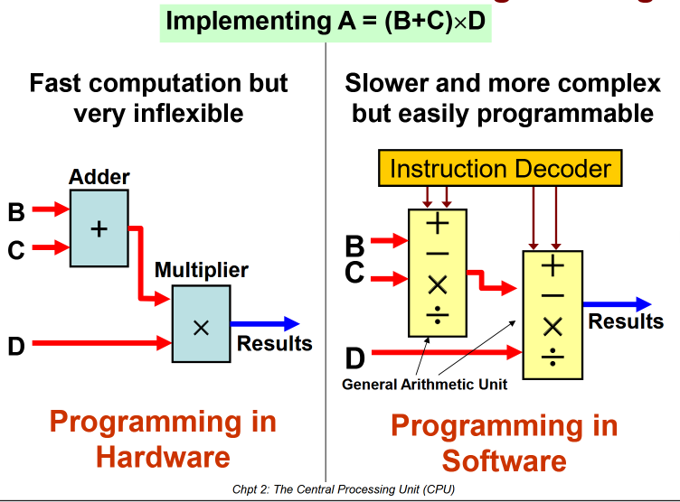

## von Neumann Architecture
The stored program concept:
1. Both data and program are stored in the same memory
2. Contents of memory are addressable by location, without regard to data type
3. Execution occurs sequentially (unless explicitly modified)
- Memory Layout:
	- 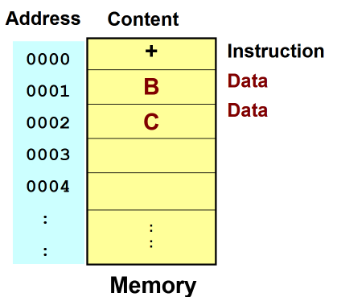
	- Memory layout includes the data and instructions visualised in a memory map\

# Instruction Set Architecture
- 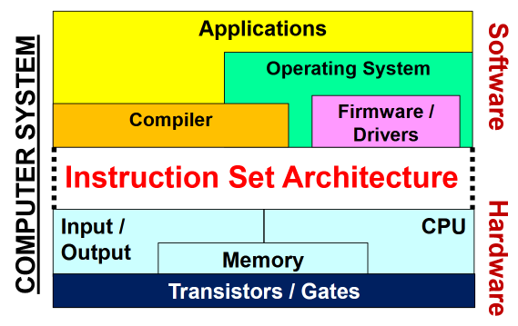
- The Instruction Set Architecture is the interface between the Hardware and Software which includes machine code/instructions and data organization.

# Basic components of a microcomputer
Components of a microcomputer:
- 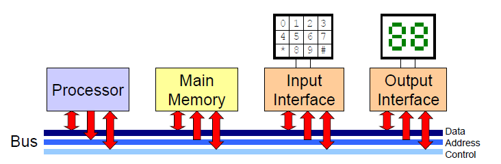
- Interconnected by a bus structure, which consist of a collection of wires through which binary information can be transferred in parallel.

## Memory

### Memory Layout
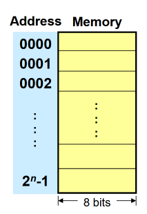
- Each Memory page has 8 bits/1 byte/2 hex and has a unique address that can be access via the **address bus**. 
- The main memory size depends on the **number of lines (n)** in the **address bus**.
- In modern CPUs, the address bus is in the SoC chip that connects between the CPU and the memory controller.

### Byte-Ordering & Endianness
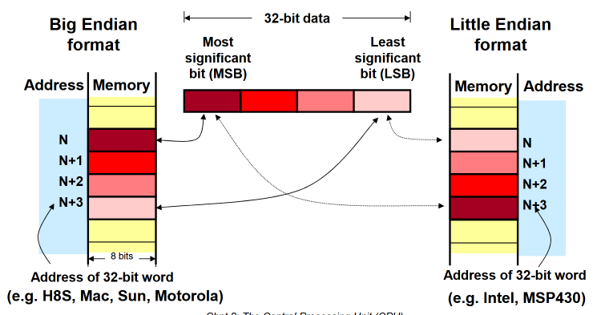

Most significant bit
- The leftmost bit in a number, highest place value
Least significant bit
- the rightmost bit in a number, lowest place value
Example: Consider the 8-bit binary number 10101010
- MSB: 1
- LSB: 0

When storing multi-byte data, such as integers or addresses, there are 2 byte ordering schemes:
1. Big Endian
	- stores the most significant byte, followed by less significant
2. Little Endian
	- Stores the least significant byte, followed by more significant

Example: Consider a 32-bit integer (4 bytes) with value 0x12345678 in a word-sized memory map
- Big Endian:

| Address | Contents |
| ------- | :------: |
| 0x0000  |   0x12   |
| 0x0001  |   0x34   |
| 0x0002  |   0x56   |
| 0x0003  |   0x78   |

- Little Endian:

| Address | Contents |
| ------- |:--------:|
| 0x0000  |   0x78   |
| 0x0001  |   0x56   |
| 0x0002  |   0x34   |
| 0x0003  |   0x12   |

### Memory Map
is a visual means to show the contents of some consecutive address space, usually in hexadecimal.
- They can be drawn in byte or word-sized. A word is 2 byte
- 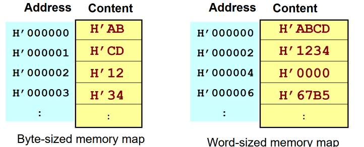
	- Byte-sized memory map where each entry contain 1 byte
	- Word-sized memory map where each entry contain 2 bytes
		- Example: We want to know what is stored at address 3 in word-sized map
		- In Big Endian, the data is 34 because its the **least significant bit**
		- In Little Endian, the data is 12

 Example 0x12345678 in word-sized memory map (2 byte address width):
1.  Big Endian:

| Address | Contents  |
| ------- | --------- |
| 0x0000  | 0x12 0x34 |
| 0x0002  | 0x56 0x78 |

2. Little Endian:

| Address | Contents  |
| ------- | --------- |
| 0x0000  | 0x78 0x56 |
| 0x0002  | 0x34 0x12 |

## Input/Output
### Peripherals and I/O Interfaces
- Loosely Coupled
	- via an external bus (USB, Firewire)
	- via network (Ethernet)
	- via port (serial, parellel, ps2)
- Tightly Coupled
	- via fast internal bus (graphics card, hard-disk controllers)
- 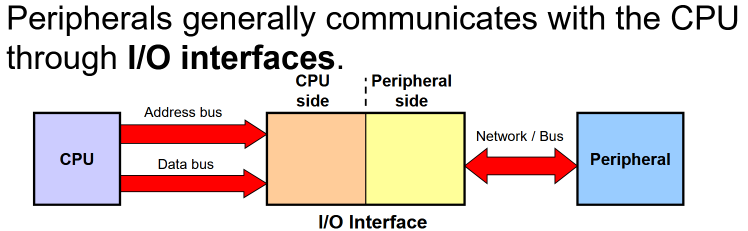

## Role of the CPU
- **Fetch instructions** - CPU read instructions from memory
- **Decode instructions** - Decode instructions to determine actions
- **Fetch data** - Some data from memory may be needed for execution
- **Execute** - Execution of instructions, may perform arithmetic or logical operations
- **Write data** - Results can be stored in CPU temporarily or back to memory

*This is a fetch-decode-execute cycle*

### Divided into 3 sections:
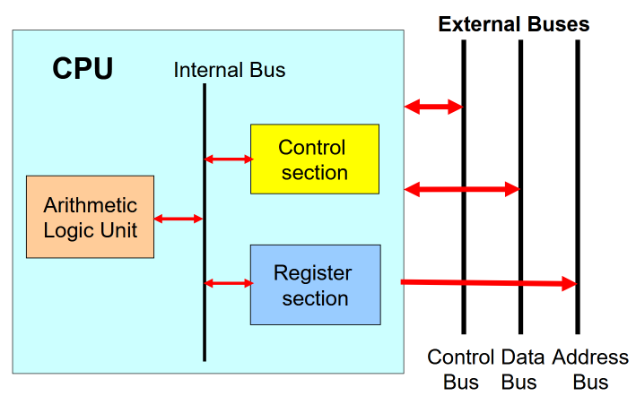
#### Register section
General user visible registers
- Data register
	- used to hold data temporarily during CPU operations
- Address register
	- used to hold addresses of operands in memory
- Stack pointer
	- a special register that is used to manage a stack in memory

Special user visible registers
- Status register
	- contains the **current status of the CPU** and a set of **condition code register** (CCR) flags that indicates the outcome of the ALU operations.
- Program Counter
	- contains the address of the next instruction to be executed

##### Common condition code flags
- **Negative (N)**
	- flag is set whenever the MSB of the result is 1
- **Zero (Z)**
	- flag is set whenever the result is 0
- **Overflow (V)**
	- flag is set whenever the result cannot be represented by the 2's complement range of number representation aka an **integer overflow**, **this is for signed integers calculations**
		- Addition: A + B = -C
			- If A & B are positive, C cannot be a negative number, thus the flag will be set
		- Subtraction: A - (-B) = -C
			- If A is positive and B is negative, C cannot be a negative number, thus the flag will be set
- **Carry (C)** 
	- flag is set whenever the result of an **addition causes a carry** at the MSB or a **subtraction causes a borrow** at the MSB
		- Example (adding 8-bit values):
			- `  10011010   (0x9A)`
			- `+ 10000111   (0x87)`
			- `1 00100001   (9-bit result)`
			- Because a carry out occurred, the CPU sets the CF=1
		- Good for detecting **unsigned integer overflow**
 
Non-user visible registers
- **Instruction register** - holds the opcode of the current instruction that is being executed, sometimes it holds the entire instructions
- **Temporary or buffer registers** - holds the address or data internally during intermediate stages of CPU operations or instruction execution (e.g. arithmetic operations, I/O, interrupts)

#### Arithmetic Logic Unit
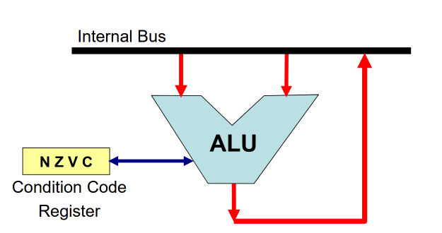
- It is the section that performs arithmetic and logical operations
- A 32-bit CPU has 32-bit internal bus
- An ALU contains buffer registers for temporary storage for input operands and result

Various functional circuits that perform different requirements
1. **Arithmetic Unit** - performs math (addition, subtraction, division and multiplication)
2. **Logic Unit** - performs logical operations (AND, OR, XOR)
3. **Shift Unit** - performs bit shift and rotation
- Operations can influence the CCR flags

#### Control Unit
is the brain of the CPU

- Roles:
1. **Decoding instructions** - it decodes opcode fetched into the instruction register into internal and external 
2. **ALU** - it activates specific ALU functions based on the instructions
3. **Movement of data** - it controls movement of data between memory-registers and or internally between registers
4. **External signals** - it handles external signals into the CPU such as interrupts and resets

The Clock synchronises and controls the control unit. Each instruction has micro-operations that are performed at state change of the CPU clock.

### Impacts of bus widths
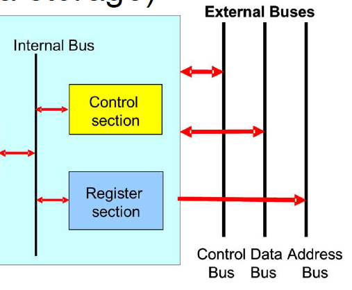
- CPU Internal Bus (16-bit, 32-bit, 64-bit)
	- It impacts the number of bits a CPU can process in one clock cycle
	- 32-bit CPU means that the CPU can process 32-bit numbers at any given time
- Data Bus
	- How much data can be transferred in 1 cycle
	- 32 bit data bus means that the CPU can fetch 32 bits worth of data to and from the primary memory
- Address Bus:
	- How large is the address space
	- 32-bit address bus means that there are 32 lines carrying 0 or 1 which means 232 worth of unique addresses

# Basic Execution Cycle
Example: `add.w #3, R1`
1. Fetch Cycle - Instruction
	- PC puts address of instruction on external address bus
	- Control Unit generates read signal
	- Instruction is fetched from memory to Instruction Register and decoded in Control Unit
2. Fetch Cycle - Operand
	- PC puts address of operand on external address bus
	- Control Unit generate read signal
	- Operand #3 is fetched from memory to Buffer Register
3. Execute Cycle - Add
	- Control Unit sends ALU signals to add Buffer Register and R1
	- Result of addition is returned to R1

# Different Computer Architectures
## Harvard Architecture
- have separate memory for program and data
- as compared to von Neumann Arch where it has shared memory

## Flynn's Taxonomy
- Classify architectures based on number of instructions and data streams
- S for single, M for multiple
- SISD
	- **A single instruction operating on a SINGLE SET of data**
	- Single processor takes data from a single address in memory and performs a single instruction on the data at a time.
	- Example: von Neumann Architecture was SISD, microcontrollers, **single core**, cheap
- SIMD
	- **A single instruction operating on multiple SETs of data**
	- Example: GPUs
- MISD
	- **Multiple instructions operating on a single data simultaneously**
	- Example: airplane computers that rely on fault tolerance/redundancy
- MIMD
	- **Multiple instructions operating on multiple SETs of data simultaneously**
	- Example: multi core processors

### RISC & CISC
- CISC: Complex Instruction Set Computer
	- One instruction requires the CPU to perform multiple complex operations
		- Complex instruction-decoding logic, driven by the need for a single instruction to support multiple addressing modes.
		- Instructions which require multiple clock cycles to execute.
- RISC: Reduced Instruction Set Computer
	- One instruction usually performs a smaller number of operations
		- Reduced instruction set.
		- Less complex, simple instructions.
		- Hardwired control unit and machine instructions.
- 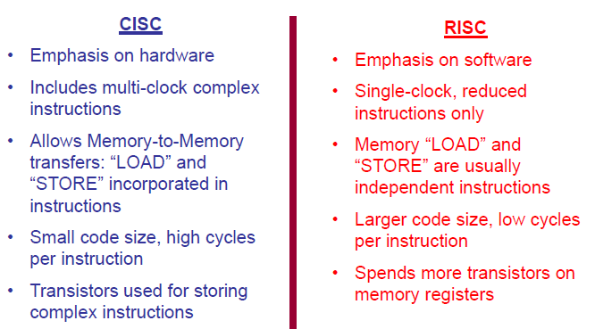

