# Examples of Computers
## Microprocessor-based System
- A microprocessor forms the core of the system with external memory and I/O support added to provide operational capabilities. 

- Many modern day desktop computers are microprocessor-based systems
	- 

## Microcontroller-based system
A microcontroller has built-in memory and I/O support
- compact operational system.

Properties:
- Entire Implementation on a single chip
- Low-Cost
- Low Power
- Low clock frequency
- 4 bits to 32 bits devices
- Limited Memory
- I/O uses pin-out (typically 8 to 150)

Low power consumption:
- 0.1 µA for RAM detection
- 0.8 µA for real-time clock mode operation
- 250 µA/MIPS during active operation

## MSP430 MCU Overview
Clock: 25Mhz
### Internal & External Buses
The MSP430 has:
- 16-bit internal bus (process 16-bit numbers at 1 time)
- 16-bit external data bus (process 16-bit of data to main memory)

Different models have different memory address bus: this model has 16bit address bus, 216

# MSP430 CPU ISA
## MSP430 Micro-Architecture

### 16-bit RISC CPU
- 27 core instructions (8 Jump, 7 single and 12 double-operand instructions)
- 7 addressing modes
- 8/16-bit instruction addressing format (it can fetch and process both)

### Memory Architecture
- 16 16-bit registers
- 16-bit ALU
- 16-bit data bus
- Supports 8/16-bit peripherals
- Address bus size depends on model

### Registers
- R0 = PC
- R1 = Stack Pointer
- R2 = Status Register
- R3 / R2 = Constant Generator
- R4 to R15 = General Purpose Registers (working registers)

- Example
	- `add.w R11, R12`
	- add word
	- R12 = R11+R12
		1. Read R11 & store into source operand
		2. Read R12 & store into destination operand
		3. Select add operation in the ALU
		4. Store the result into R12

#### R0 - Program Counter PC
It is a 16-bit register that **points to the next instruction to be executed (holds the memory address of the next instruction word to fetch)**
- increments after each instruction is executed
- Instructions are always performed in word boundaries
	-  The PC's instruction is incremented by 2 and therefore is aligned to even addresses

PC can be addressed by all instructions and all addressing modes

- Each instruction uses an even number of bytes
	- There are 2, 4 or 6 bytes instructions in the MSP430

#### R1 - Stack Pointer
used to store a memory structure for addresses of subroutine calls and interrupts

- **Manage the stack**: The SP points to the memory location where **the last item** that was pushed onto the stack.
- **Store and retrieve data**: The SP is used to store and retrieve data on the stack, such as function arguments, local variables, and return addresses.

- **PUSH instruction will decrement the SP by 2**
- **POP instruction will increment the SP by 2**
- The stack in the MSP430 is a **downward-growing stack** and the SP points to the **top of the stack.**
- PUSH instruction will pre-decrement (before storing, it needs to **pre-emptively** decrement the pointer by 2)
- POP instruction will post-increment (it can retrieve stuff because it is **already pointing to the last item that was pushed onto the stack**, thereafter incrementing it by 2)
- [Ep 081: Introduction to the Stack Pointer](https://www.youtube.com/watch?v=n8_2y5E8N4Y)

These instructions will not zero the memory cell value which is useful for forensics

#### R2 - Status Register
- Can be used to support constant generator
- Used to store the CCR flags (V, N, Z, C)

#### R2/R3 - Constant Generators
is used to reduce the requirement to store commonly used constants in registers
- Depending on the addressing modes value, 6 constants can be generated
	- 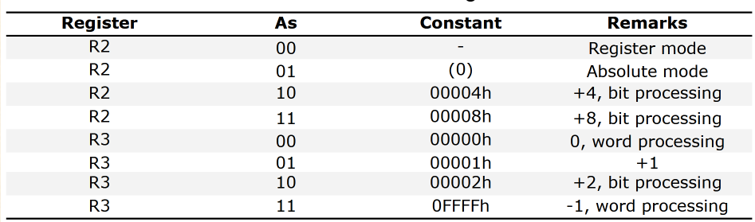
	- saves memory and execution time

#### General Purpose Registers
Used as data registers
- each register is 16 bits
- can support operations on words or bytes

## Memory Organization
- Word Alignment
	- Byte memory are located at even or odd addresses
	- Word memory are only located at **even addresses**

- Example
	- 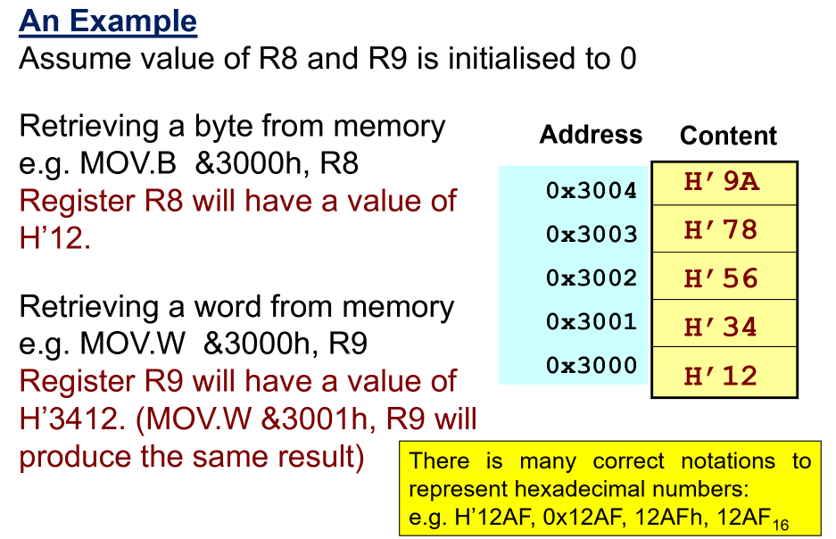
	- if `MOV.w &3001h, R9`, it will produce the same result because transferring word data will shift the address up to even	

## Machine Code & Assembly Instructions
### MSP430 Instructions
- 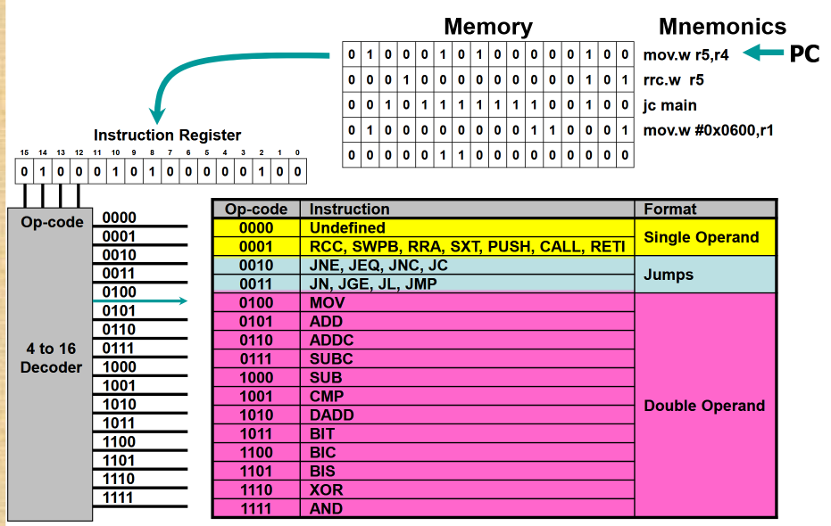
	- The Mnemonics is assembly code that can be turned into binary bits(machine code) as an instruction
	- The op-code correspond to the type of instruction

MSP430 instruction set supports 3 data types:
- Bit
- Bytes
- Words

In assembly, instructions(for single and double operands) will depend on the suffix used .w(word) or .b(byte)
- If suffix is ignored, the instruction will process word data by default

#### 12 Double Operand Instructions
**includes a source and destination registers**
- 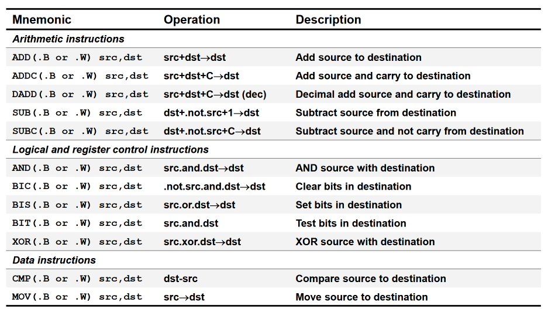
- 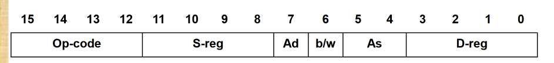
- Source Operand Address (src): Can be defined by the source register (S-reg) & the addressing mode in As
- Destination Operand Address (dst): Can be defined by the destination register (D-reg) & the addressing mode in Ad.
- B/W: byte or word instruction (0: 16-bit instruction, 1: 8-bit instruction)

- Example:
	- 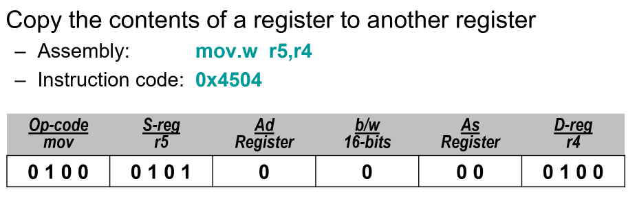
	- Copy a word (16-bit) contents from R5 to R4
	- Looking at the [quick reference](https://xsite.singaporetech.edu.sg/d2l/le/content/176620/viewContent/853838/View):
	- 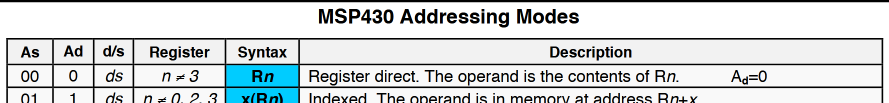
	- Addressing mode for both operands are register direct, so As = 00 & Ad = 0
	- 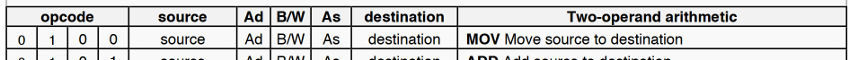
	- Opcode is 0100
	- S-reg is R5: which is 0101 in binary
	- D-reg is R4: which is 0100 in binary
	- b/w will be 16 bits: 0

#### 7 Single Operand Instructions
Instructions include only 1 register
- 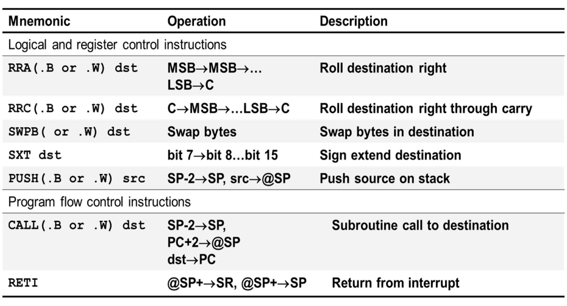

- Example:
	- 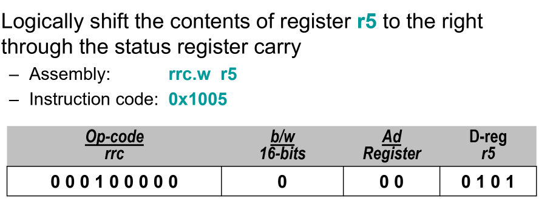
	- 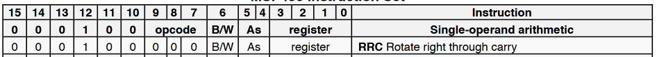
	- RRC Op-code is above
	- b/w: 16 bits for word: 0
	- As: addressing mode is 00 because register direct
	- D-reg: destination register R5 is 0101 in binary
		- What it does: The CPU shifts the 16-bit register R5 1 bit to the right (divide by 2) - the carry bit prior to the instruction becomes the MSB of the result while the LSB shifted out replaces the carry bit in the status register

#### 8 Jump Instructions
are used to direct program flow to another part of the program
- 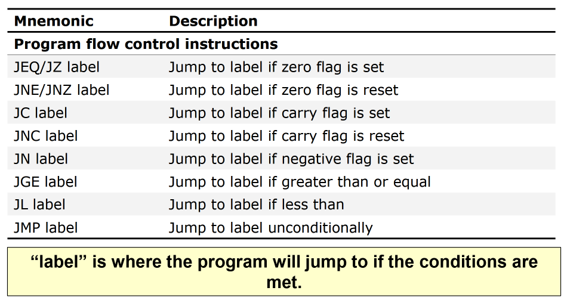
- 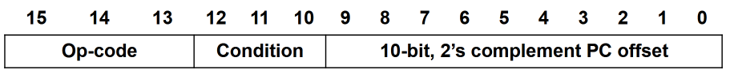
	- Op-code: the type of instruction
	- Condition: Jump when its true
		- 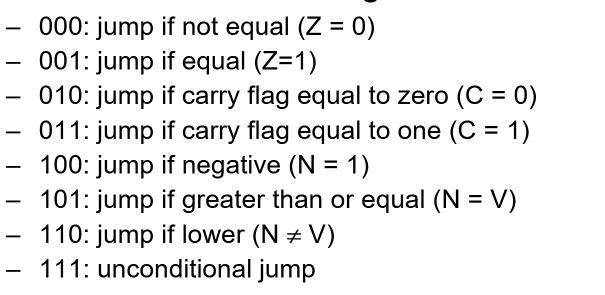
	- Displacement: add (n amount of bits)x2[word] to the program counter
		- In 10-bit 2's complement, the most significant bit (MSB) represents the sign of the number.
			- If the MSB is 0, the number is positive.
			- If the MSB is 1, the number is negative.		
		- To find the decimal equivalent of a 10-bit 2's complement number:
			- If the MSB is 0, the number is positive and can be converted directly from binary to decimal.
			- If the MSB is 1, the number is negative. To find its decimal equivalent, you need to invert the bits and add 1 to get the 2's complement, then convert it to decimal and add a negative sign.
		- The range of 10-bit 2's complement numbers is: −29 to 29−1 which equals: −512 to 511
			- Example: Representing -2 in 10-bit 2's complement
			- Binary: 2 = 0000000010
			- Invert: 1111111101
			- Add 1: 1111111110

- Instruction Format:
	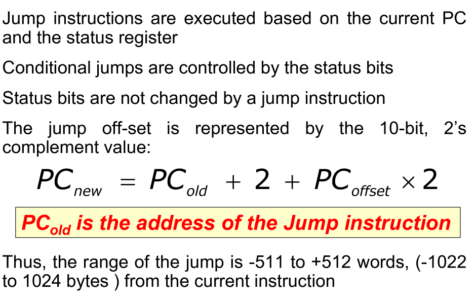
	- PC_new: The new instruction
	- PC_old: The old instruction
	- +2: A jump instruction is 2 bytes long
	- PC_offset: The displacement (10-bits aka jump off-set)
	- x2: Multiply by 2 because word

- Example:
	- JNZ Instruction: Jump if not equal to zero (Continue execution at the label Delay if the Zero bit [Z-flag]is not set)
	- 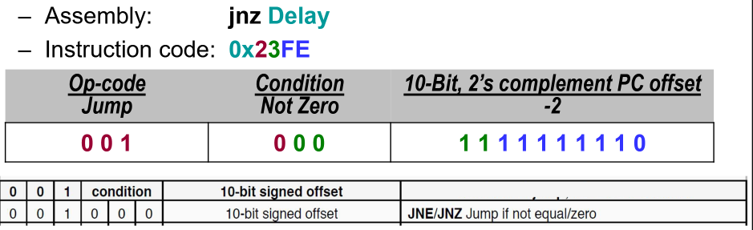
	- Lets say the assembly code: `jnz Delay` is at 0x202 address
	- The label (the program you want to jump to) is at 0x200 address
	- Using the formula $PC_{new} = PC_{old} + 2 + PC_{offset} \times 2$ 
	- sub $PC_{new} = 200$ & $PC_{old} = 202$ , you get $PC_{offset} = -2$ 
	- 10-bit, 2's complement offset of -2 is 1111111110
	- Op-code of JNZ is 001000

## Addressing Modes
specifies the source and destination of the operands

- There are:
	- 7 addressing modes for the source operand (1 register, 5 memory, 1 immediate)
	- 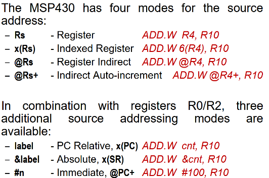
	- 4 addressing modes for the destination operand (1 register, 3 memory)
	- 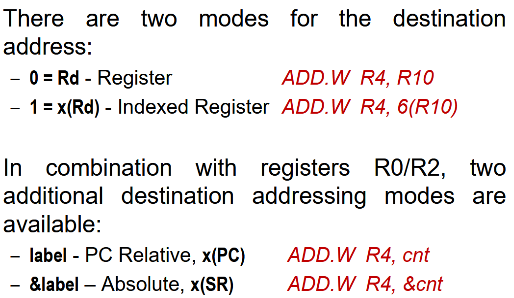
- Can be located in any memory space address, but user needs to be aware of the effects
- Selected by the `As` and `Ad` fields 

- 3 Source Operand Data Sources: 
	- Registers, Memory(data), Instruction itself (immediate addressing mode/CG)
- 2 Destination Operand Location: 
	- Write to register or memory

Following examples will include **clock cycles and instruction** for various addressing modes' **fetch-decode-execute.**
- How clock cycle are calculated:
	- Fetch: How many **words of instruction** are to be retrieved from memory?
		- 1 word = 1 cycle, 2 word = 2 cycle
	- Decode: Usually 0 because of hardwiring
	- Execute: How many operand accesses via memory (read & write)?
		- Register to register = 0
		- Constant Generator (CG) giving constants = 0
		- Write to memory once = 1
		- Note: MSP430 performs a read of the destination word. This is required for:
			- byte writes on a 16‑bit bus: the processor must read the 16‑bit word, merge the byte into the correct half, then write back the full word to avoid corrupting the other byte. (byte write: so it can properly merge the byte into the correct 1/2 of the word)
			- bus protocol and proper sequencing for memory/peripheral accesses.

### Register Direct Addressing Mode
- The data is in the register
- The contents of a register is used as the operand

- Example:
- `add.w r4, r10 ; r10 = r4 + r10`
	- Instruction code: 0x540a (opcode +params)
	- Clock Cycles:
		- Fetch instruction via address bus
			- 1 cycle from the external address bus
		- Decode instruction
			- 0 cycle because hardwired
		- Execute instruction
			- 0 cycle because it is using internal bus from registers to ALU and back to register
- Example:
- `mov R5, R4 ; R5 = R4 copy contents over`
	- Instruction code: 0x4504
	- Clock Cycles:
		- Fetch: Fetch 1 word of instruction
		- Decode: 0 cycles
		- Execute: 0 cycles because register to register
		- Total: 1 cycle

### Indexed Addressing Mode
The source data is in memory pointed by an address, and the address is in the register
- The address is: `Register Content (Address) + signed offset`
	- After execution, the contents of registers are not affected and the PC increments

- Example:
- `add.w 6(r4) ,r10         ;r10 = M(r4+6) + r10  memory is at r4 + 6`
	- Instruction code: 0x541A 0x0006
	- Clock cycles:
		- Fetch: 2 words of instruction
		- Decode: 0 cycles
		- Execute: 1 cycle because read 1 value from 1 address from memory specified by R4+6
		- Total: 3 cycles

- Example:
- `mov.b 4(r5), 1(r4)       ;Copy contents from M(r5+4) to M(r4+1)`
	- Instruction code: 0x45D4 0x0004 0x0001
		- 0x0004 - offset for source
		- 0x0001 - offset for destination
	- Clock cycles:
		- Fetch: 3 cycles
		- Decode: 0 cycles
		- Execute: 3 cycles because read 2 value from memory(r5+4 address & r4+1 address), and write 1 value to memory(r4+1 address)
		- Total: 5 cycles

### Indirect Register Addressing Mode
Source data is in memory pointed by an address, and the address is in the register
- Can only be used for source operand (for destination, use 0 offset indexed mode)
- Any 13 registers can be used

- Example:
- `add.w @r4, r10             ; r10 = M(r4) + r10`
	- Instruction code: 0x542A
	- Clock cycle:
		- F: 1
		- D: 0
		- E: 1
		- Total: 2 cycles

- Example:
- `mov @r5, 0(r4)           ; M(r4 + 0) = M(r5)`
	- Instruction code: 0x45A4 0x0000
	- Clock cycle:
		- F: 2 words
		- D: 0
		- E: 3 cycles because read 2 values from memory, write 1 value to memory
		- Total: 5 cycles

### Indirect Auto-increment Addressing Mode
Similar to the previous 2, after executing the instruction, it will **POST-INCREMENT** the contents of the register
- Automates pointer advancement so it is possible to iterate through memory without extra instructions
	- Useful for efficiency, combines load/store and pointer update in 1 instruction
	- Compact code
- Only used for source operand

If instruction data type processed is **byte**:
- Register contents is incremented by 1
If instruction data type processed is **word**:
- Register contents is incremented by 2

Example:
- `add.w @r4+, r10           ;r10 = M(r4) + r10; R4 += 2`
	- Instruction: 1 word
	- F: 1
	- D: 0
	- E: 1
	- Total: 2 cycles

Example:
- `mov @r5+, 0(r4)           ;M(r4 + 0) = M(r5); R5 += 2`
	- mov by default is mov.w
	- Instruction code: 0x45B4 0x0000
	- F: 2
	- D: 0
	- E: 3 (1 from write, 2 from read)
	- Total: 5 cycles

### Symbolic Addressing Mode (PC-relative)
Similar to indirect register except that it can take in the label in another part of the assembly program. This label is used to point to data in the program. 
- During runtime, the CPU will need to add the offset to the PC to form the effective address that points to the data for our operand. 
- $PC + offset = \text{Effective memory address for data}$
How the assembler calculates offset:
- The assembler will compute the offset = address(label_name) - address(next_word) where next_word is the PC value after the instruction word
- Offset will be stored as part of the next instruction (e.g. 0xinstruction 0xoffset)

Example:
- `add.w cnt,r10            ; r10 = M(cnt) + r10`
	- Instruction code: 0x501A 0xoffset
	- F: 2 words
	- D: 0 
	- E: 1 from read memory
	- Total: 3 cycles

Example:
- `mov EDEN,TONI           ; M(TONI) = M(EDEN)`
	- Instruction code: 0x4090 0xoffseteden 0xoffsettoni
	- F: 3 words
	- D: 0
	- E: 3 memory accesses
	- Total: 6 cycles

### Absolute Addressing Mode
Similar to symbolic except the `&` is used to **specify the address of the data where the label is pointing to.** 
- The address will then be stored as part of the next instruction (e.g. 0xinstruction 0xaddress)
- Can be used for source and destination operands

Example:
`add.w &3002h,r10`

Example:
- `add.w &cnt,r10          ;r10 = M(cnt) + r10`
	- Instruction code: 0xinstruction 0xaddress
	- F: 2 words
	- D: 0
	- E: 1 memory access
	- Total: 3 cycles

Example:
- `mov &EDEN, &TONI        ;M(TONI) = M(EDEN)`
	- Instruction code: 0x4292 0xaddresseden 0xaddresstoni
	- F: 3
	- D: 0
	- E: 3
	- Total: 6 cycles

### Immediate Addressing Mode
The data is actually part of the instruction.
- Allows values to be loaded directly into registers or memory addresses
- Only for source operands.
- The value is stored as part of the next instruction (e.g. 0xinstruction 0xhex_value)

Example:
- `add.w #100,r10        ;r10 = #100 + r10`
	- Instruction code: 0xinstruction 0x0064
	- F: 2
	- D: 0
	- E: 0
	- Total: 2 cycles

Example:
- `mov #0x0200,r5       ;r5 = #0x0200`
	- Instruction code: 0x4035 0x0200
	- F: 2
	- D: 0
	- E: 0
	- Total: 2 cycles

Example: Constant Generator
- `add.w #1,r10        ;r10 = #1 + r10`
	- To be efficient we can use the CG to get value of 1, use the ISA to compute the following
	- Instruction code: 0101(add) 0011(src reg: CG) 0(Ad) 0(B/w) 01(As: CG) 1010(dst reg)
	- Instruction code: 0x531A