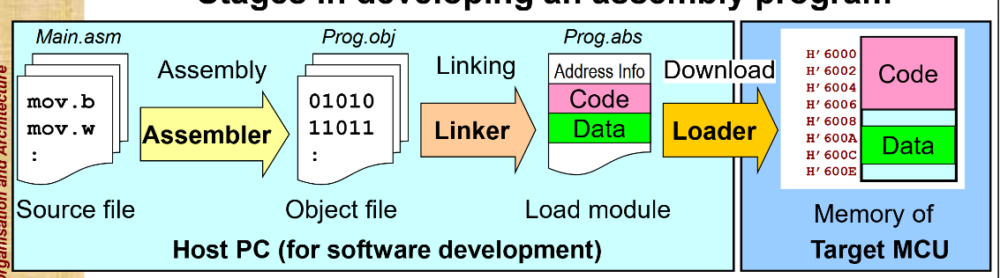
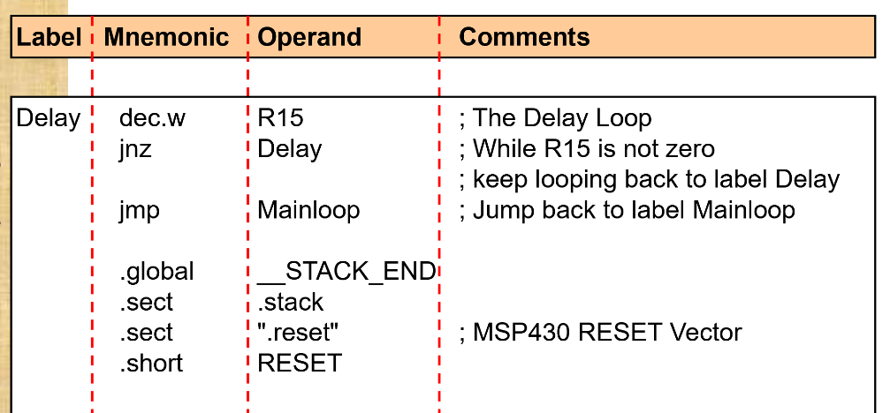
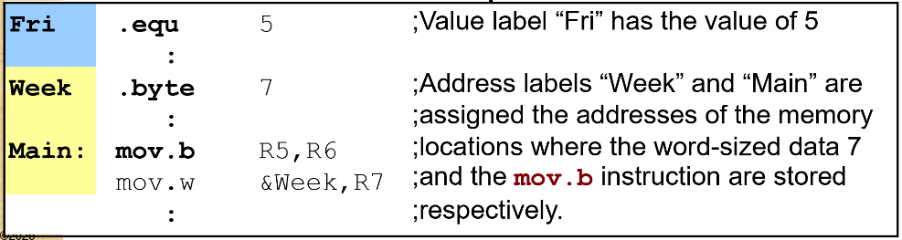
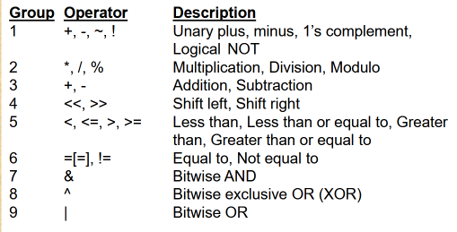
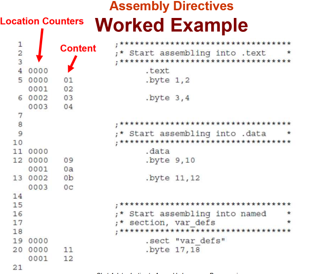
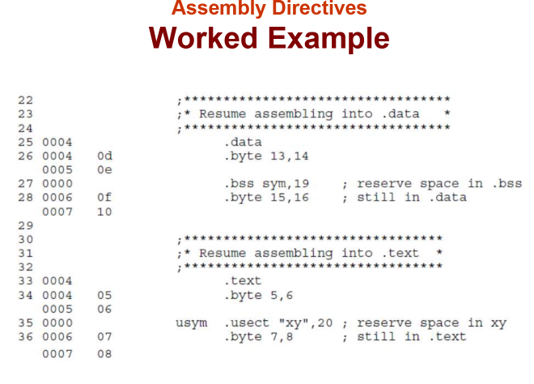
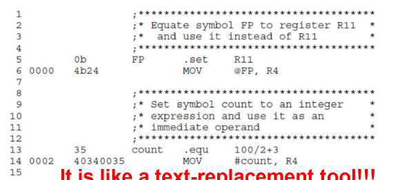
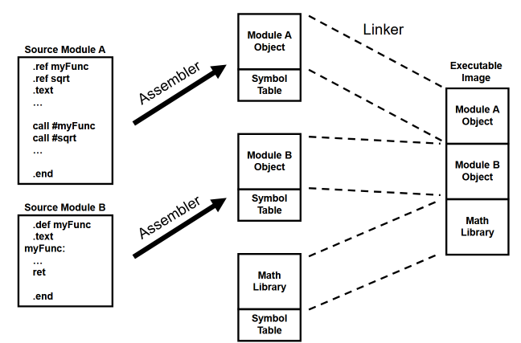

# Introduction
## What is assembly programming
High-level languages properties:
- Easy to write and understand
- Performs data type casting/checking
- No details about how fast it would run or how many bytes of memory is needed to store the instructions

Assembly Language:
- Written in mnemonics of basic instructions supported by the processor
- Not as simple to understand program
- Programmer know exactly what operations the processor is going to perform
- Can calculate the memory needed to store the code and the time needed to execute the code

Machine code:
- The exact binary bits that are stored in the memory to instruct the processor to carry out certain operations.
## Why and when to use assembly programming
- Reduce unnecessary programming overheads (some languages perform data type checking)
- More compact program size (embedded devices may not have much built-in memory but require more and more functionalities)
- Faster execution speed (algo for processing signals in smartphones can be computationally demanding and need to operate in real-time)
- Critical parts of the OS software (kernel of system constantly executed)
- I/O intensive codes (device drivers and "loopy" segments of code that processes streaming data)
- Time-critical or time-dependent codes (need to respond quickly)


---
# Assembly Program Basics
## Stages in assembly program development

- Development Tools
	- Text editor
		- edit the text-based mnemonics in source file (.asm)
	- Assembler
		- converts mnemonics in source file into machine code and produces an object file (.obj)
	- Linker
		- combines several object files (library files) into a load module that contains machine code and address information (.abs)
	- Loader
		- uses load module's address info. to download instructions and data constants into appropriate memory areas for execution

### Characteristics of Assembly Programs
Made up of 2 types:
1. Executable instructions
	- Valid instructions of the processor and executed when the program runs
2. Assembler directives
	- desired characteristics of the program and are processed during program assembly. It also influence the way the program is loaded into memory

## Assembly Language Syntax
Typical language format:
- 
	- `[label[:]] mnemonic [operand list][;comment]`

Guidelines:
- Max 200 characters per line
- All statements must begin with a **label, a blank, an asterisk, or a semicolon**
- Labels are optional; if used, they must begin in column 1
- 1 or more blanks must separate each field, tab(\t) and space(\s) characters are blanks
- Comments: Use * at the 1st column, ; in any other columns
- Mnemonic only start at column 2

### Label Column
- Labels are optional
- Column 1 only
- 128 alphanumeric characters (A-Z, a-z, 0-9, _, and $)
- Case Sensitive and 1st character cant be number
- Can be followed by a colon
- A label on a line by itself is a valid statement
- No label = must **use a blank, ; or * for the first character**

Address and Value Labels
- **used as a reference to the address of an instruction or data (address label)**
- when used with the `.equ` directive, it takes on the value of the corresponding constant (value label)
	- 

### Mnemonic Column
- Start in column 2
- Begin with 1 of the following items:
	- Machine-instruction mnemonic (e.g. ADD, MOV, JMP)
	- Assembler directive (e.g. .data, .list, .equ)
		```
		   .data
		Day .byte Fri ;initialize byte-sized memory to Fri
		Mth .space 12 ;allocate 12 bytes of memory
		```
- Many opcode mnemonics require a suffix to indicate size of data (e.g. mov.b, mov.w)

### Operand Column
- Not required for all instructions or directives
- Consists of the following:
	- Symbols
	- Constants
	- Expressions (combination of both)
- Separate operands with commas

- Example:
	- `mov.b R5,R6` ;move byte in register R5 to R6, 2 operand
	- `dec.w R15` ;decrement the value in R15, 1 operand
	- `ret` ;return from subroutine, no operand

- Constants
	- Treated as unsigned
	- Types of constants
		- Decimal: string of decimal digits
		- Hexadecimal: string of 8 hexadecimal digits followed by 'h' or preceded by '0x'
			For hex starting with 'A' to 'F', always precede the number with a '0', else it will be treated as a label
		- Octal: string of up to 8 hexadecimal digits followed by 'Q/q' or preceded by '0'
		- Binary: String of up to 32 binary digits followed by suffix 'B/b'

- Expressions
	- A constant, a symbol or a series of constants and symbol separated by arithmetic operators.
		- Parentheses are evaluated first: 8 / (4 / 2) = 4
		- Precedence groups operators: 8 + 4 / 2 = 10
		- Left to right evaluation
	- Other operators:
		- 

### Comments Column
Comments are ignored by the assembler

---
# Assembler Directives
supply data to the program and control the assembly process

- Assemble code and data into specified sections
- Reserve space in memory for uninitialized variables
- Control the appearance of listings
- Initialize memory
- Define global variables
- Specify libraries from which the assembler can obtain macros

- Symbols
	- Very similar to Labels. Symbols used as labels become symbolic addresses that are associated with locations in the program

## Select assembler sections (.sect, .text, .bss, .usect)
- A section is a block of code or data that occupies contiguous space in the memory map.
	- Each section has its own Location Counter
	- Purpose is to tell the linker/loader how to place and treat the content in that section.

2 types of sections:
- Initialized sections (in ROM (HDD,SSD,storage), will retain data when powered down) (e.g. .sect, .text, .data) (runtime values live in RAM)
- Uninitialized sections (in RAM, will not retain data when powered down) (e.g. .bss, .usect)

Examples:
- .text (default)
	- usually contains executable code.
- .data (default)
	- usually contains initialized data.
- .sect
	- user defined named section, associating subsequent code or data with that section
- .bss (default)
	- for uninitialized variables
- .usect
	- similar to .bss, except its user defined with a name (like .sect)

### Location Counter
- holds the relative memory position of an instruction within the current section
	- It is used during the assembling process to
		- determine the current address for labels
		- compute offsets and sizes
		- Labels: will assign that label with the current location counter value
	- Tracks the current address where the assembler will place the next byte of code or data

- A ($) dollar sign is used as an operand to an instruction to refer the current value.

## Define values for memory locations (.byte, .word, .string)
Places data in memory

- Example:
	- .byte
		- Places 1 or more 8-bit values into consecutive bytes of the current section
		- ` .byte 0AAh,0BBh`
		- Memory: 0xaa 0xbb
	- .word
		- Places 1 or more 16-bit values into consecutive bytes of the current section
		- ` .word 01234h`
		- Memory: 0x1234
	- .string
		- Places 8-bit characters from 1 or more character strings into the current section using ASCII encoding (similar to .byte)
		- ` .string "help"`
		- Memory 0x68 0x65 0x6C 0x70
	- .float
		- Calculates a 32-bit MSP430 floating-point representation of a single precision floating-point value and stores it in 4 consecutive bytes in the current section
		- ` .float 3.141592654`
	- .double
		- Similar to .float, but for a 48-bit floating-point and store it in 6 consecutive bytes
		- ` .double 3.141592654`
	
	- .space
		- Reserves a specified number of bytes in the current section.
		- Filled with bytes of 0s.
		- When used with a label, it will point to the first byte of where the label is in code.
		- `Res1: .space 17; Reserve 17 bytes of 'space' at Res1`

Examples:
- 
	- Add stuff to .text section
		- Allocate byte 1 and byte 2
		- Allocate byte 3 and byte 4
	- Add stuff to .data section
		- Allocate byte 9 and byte 10
		- Allocate byte 11 and byte 12
	- Create and add new stuff to section "var_defs"
		- Allocate byte 17 and byte 18

- 
	- Add stuff to .data
		- Allocate byte 13 and byte 14
	- Allocate 19 bytes in .bss and start of with SYM as a label
	- Still in .data
		- Allocate byte 15 and byte 16
	- Add stuff in .text
		- Allocate byte 5 and byte 6
	- Add a usect section "xy" with a starting label USYM and reserve 20 bytes
	- Still in .text
		- Allocate byte 7 and byte 8
## Create symbol table entries (.equ, .set)
- It can be used to equate a constant value to a symbol. Can be used like a constant variable.
- The .set and .equ are the same and allows you to equate meaningful names with constants and other values
Syntax:
```
symbol .set value
symbol .equ value
```

- 
## Define library references and definitions (.global, .ref, .def)
- Library
	- A set of routines for a specific domain application (like libraries/dependencies)
	- Example: math, graphics, GUI
	- Using `.ref` directive to **reference symbols defined outside a program**
	- Like importing libraries in higher level

- Library routine 
	- Labels for the routines are defined using `.def`
	- Has its own symbol table
	- A linker resolves the external addresses before creating the executable image
	- Reports and unresolved symbols
	- Like Function variables in higher level, implementing libraries

`.global`
- Declares a symbol to be external so that it is available to other modules at link time. Acts as `.def` for defined symbols and `.ref` for undefined symbols
- Like exporting functions in higher level

- 
Source Module A (a .asm code)
- `.ref myFunc` will import Source Module B
Source Module B (another .asm code)
- `.def myFunc` will define a code as a library
## Specify end of program (.end)
` .end`
- is an optional directive **that terminates assembly.** The assembler ignores any source statements that follow an .end directive. Useful for debugging.

## Assembly Process
The assembler translates assembly (.asm) into the machine language of the ISA (.obj)
- It is a 1-to-1 correspondence between assembly language instruction and instruction in the final machine language.

First pass:
- **Find all labels and their corresponding addresses** and <u>store it in the symbol table</u>.

Second pass:
- Convert instructions to machine language, using information from symbol table.

---
# Information on Executable Instructions
Executable Instruction are assembly mnemonic instruction that are assembled into machine code and executed by the MSP430.

- Information for the assembly instruction can be obtained from:
	- MSP430 Quick Reference
	- MSP430 Instruction Set Summary
- It includes:
	- Machine code translation
	- Instruction operation and description
	- Impact on the status bits
	- Length and clock-cycle information