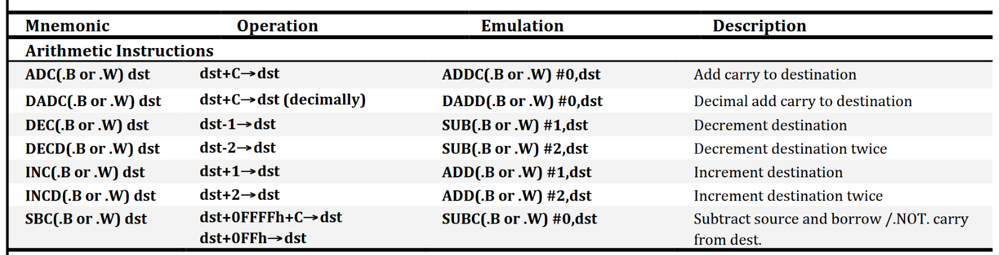
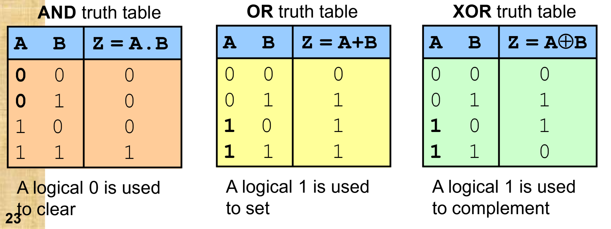
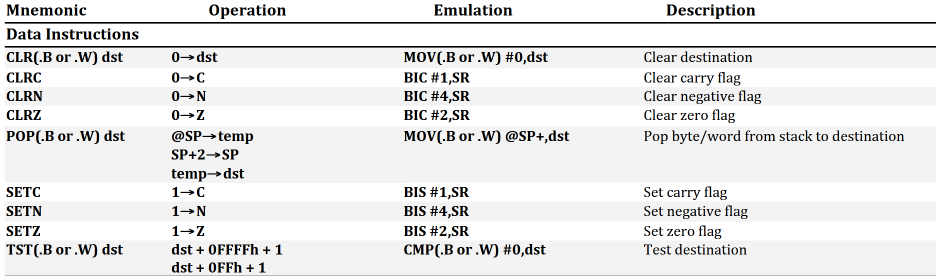
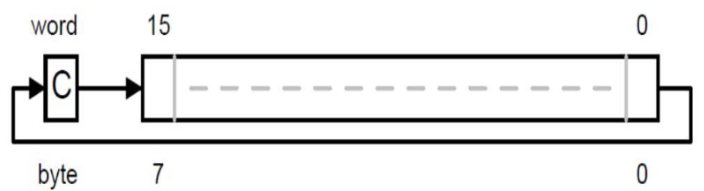
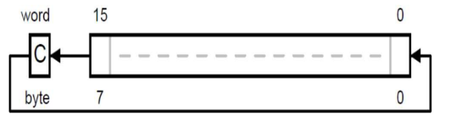
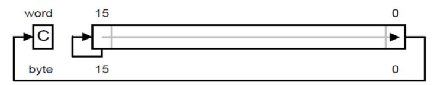
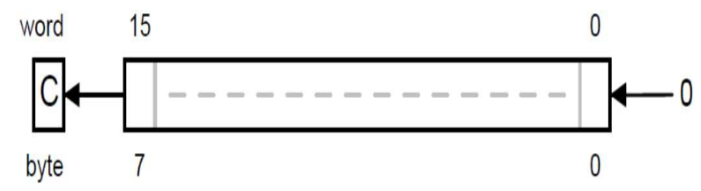

# MSP430 Instruction Set and Emulated Instructions
MSP430 has 27 Core instructions
- Convertible to machine code

MSP430 supports another **24 Emulated Instructions**
- These instructions are emulated by 1 of the Core Instruction
- Does not add any new functionality, but makes coding easier
---
# Executable Instructions
## Data Movement
### MOV
- An instruction that provides data movement between a source and a destination.

Usage:
```
mov.x src,dst
```
- Suffix .x can be byte (.b) or word (.w)

- ❎Source operand not modified 
- ❎Status Bits not affected.

Example:
- `mov.b R10, R11`
- R10: 0x1234
- R11: 0x6789
	- After execution:
	- MSB is set to 0x00
	- LSB is changed
	- R11: 0x0034

## Arithmetic
### SXT
sign-extends the **sign bit of the lower-order byte** in a register to the remaining higher-order bits.
- Usually used to convert signed byte into signed word

Usage:
```
sxt reg
```
- reg is the target register

| Status Bits | Change                                       |
| ----------- | -------------------------------------------- |
| N           | Set if result is negative, reset if positive |
| Z           | Set if result is 0, reset otherwise          |
| C           | Set if result is not 0, reset otherwise      |
| V           | Reset                                        |
- Example:
- `sxt R10`
- R10 = 0x1284, `N=0,Z=0,V=1,C=0`
	- After:
	- R10 = 0XFF84; <- the number was negative so it extends to 0xFF at 
	- `N=1,Z=0,V=0,C=1`

### ADD
Adds source operand to the destination operand
- Result stored in destination

Usage:
```
add.x src,dst
```
- suffix .x can be a byte(.b) or word(.w)

| Status Bits | Change                                                  |
| ----------- | ------------------------------------------------------- |
| N           | Set if result is negative, reset if positive            |
| Z           | Set if result is 0, reset otherwise                     |
| C           | Set if there is a carry from the result, cleared if not |
| V           | Set if an arithmetic overflow occurs, otherwise reset   |
- Example:
	- `add.b R10,R11; add byte contents in R10 to R11`
	- `add.w #2, R13; add 2 to the contents of R13`

### ADDC
Adds source operand and carry flag (C) to the content destination operand.
- Result is stored in the destination
- It will **add 1 bit to the result if the carry flag in the previous instruction was set**

Usage:
```
addc.x src,dst
```
- suffix .x can be a byte(.b) or word(.w)

| Status Bits | Change                                                  |
| ----------- | ------------------------------------------------------- |
| N           | Set if result is negative, reset if positive            |
| Z           | Set if result is 0, reset otherwise                     |
| C           | Set if there is a carry from the result, cleared if not |
| V           | Set if an arithmetic overflow occurs, otherwise reset   |
- Example: 
	- `addc.w R10,R11 ;R11 = R10+R11+C`
	- `addc.w #2,R13 ;R13 = R13+2+C`

- Example:
	- Write an assembly program to help add 2 32-bit numbers
	- `0x77778888 + 0x55556666`
	- and store the result in 2 registers, R11 store the lower 0-15 bits, R12 store the upper 16-31 bits
```
mov.w #0x7777, R12; store the higher 16-bits for 1st num
mov.w #0x8888, R11; store the lower 16-bits for 1st num
add.w #0x6666, R11; adds the lower 16-bits from 2nd num
addc.w #0x5555, R12; add the upper 16-bits from 2nd num and C-flag(0x01) from the previous operation
```

### DADD
source and destination operand are treated as 4 binary coded decimals with positive signs
- source operand and the carry C are added decimally to the destination operand

- `add.w` treats the contents as binary numbers
- `dadd.w` **treats the contents as decimal numbers**

Usage:
```
dadd.x src,dst
```
- suffix .x can be a byte(.b) or word(.w)

| Status Bits | Change                                                                             |
| ----------- | ---------------------------------------------------------------------------------- |
| N           | Set if MSB is 1, reset otherwise                                                   |
| Z           | Set if result is 0, reset otherwise                                                |
| C           | Word: Set if result is greater than 9999<br>Byte: Set if result is greater than 99 |
| V           | Undefined                                                                          |
- Example:
	- `dadd.w R10,R11; decimal of R10 = decimal of R10 + decimal of R11`
	- R10 = 0x1234
	- R11 = 0x6789
		- R11 = 0x8023

### SUB
source operand is subtracted from the destination operand
- By adding the 2's complement of the src and dst operands. Status bits are set/cleared based on normal add operation. 

Usage:
```
sub.x src,dst
```
- suffix .x can be a byte(.b) or word(.w)

| Status Bits | Change                                                  |
| ----------- | ------------------------------------------------------- |
| N           | Set if result is negative, reset if positive            |
| Z           | Set if result is 0, reset otherwise                     |
| C           | Set if there is a carry from the result, cleared if not |
| V           | Set if an arithmetic overflow occurs, otherwise reset   |
- Example:
- `sub.b R10,R11 ; R11 = R11 - R10`
	- Effectively, R11 + 2's c of R10
	- MSB of R11 will be cleared to 0x00 (byte operation)

### SUBC
subtract source operand and carry flag (C, 0x01) from content of the destination operand
- Used to support subtraction of numbers that are over 16-bits
- CCR flags are affected as per `sub.b` instruction

- Example:
```
subc.b R10,R11 ;R11 = R11 - R10 - C
subc #5,R12 ;R12 = R12 - 5 - C
```

- Example:
	- Write an assembly program to subtract 2 32-bit numbers
	- `0x77778888 - 0x55556666`
	- and store the result in 2 registers. R11 store the lower 0-15 bits of the result, and R12 store the upper 16-31 bits of the result.
```
mov.w #0x7777, R12 ;store the higher 16-bits for 1st num
mov.w #0x8888, R11 ;store the lower 16-bits for 1st num
sub.w #0x6666, R11 ;subtract the lower 16-bits
subc.w #0x5555, R12 ;subtract the upper 16-bits, and subtract C-flag from previous operation
```

### 7 more Emulated Arithmetic Instructions


## Logical and Bit Manipulation
### Logical Operations - and, bis, xor
- 3 logical operators:
	- and
	- bis (same as logical OR)
	- xor
- Status bits are affected variedly
- Source operand can either be register or immediate value

- `and` - **clear** specific bits in the destination register
- `bis` - **set** specific bits in the destination register (it's a OR operation).
- `xor` - **complement** specific bits in the destination register
	- 

| Status Bits | Change                                       |
| ----------- | -------------------------------------------- |
| N           | Set if result is negative, reset if positive |
| Z           | Set if result is 0, reset otherwise          |
| C           | Set if result is not 0, reset otherwise      |
| V           | Reset                                        |
	<font color="#00b0f0">IMPORTANT!!</font>
- For `and` and `xor` only!! ^
- `bis` does not change status bits

Example: R10=0x01010101 | N=0, Z=0, V=1, C=0
- `and.b #11110000b,R10`
	- R10 = B'01010000
	- N=0, Z=0, V=0, C=1
- `bis.b #11110000b,R10`
	- R10 = B'11110101
	- N=0, Z=0, V=1, C=0
- `xor.b #11110000b,R10`
	- R10 = B'10100101 | N=1, Z=0, V=0, C=1

### BIC
Bit-clear instruction
- The INVERTED source operand and the destination operand are logically AND'ed. Result is placed into the destination. `.NOT.src .AND. dst -> dst`
- Status flag not affected

Usage:
```
bic.x src,dst
```
- suffix .x can be a byte (.b) or word(.w)

Example:
- R11 = B'01010000
```
bic.b #11101100,R11
```
- R11 = B'00010000

### Emulated Bit Manipulation Instructions

- Programs can also modify certain bits
## Rotation
- Rotation instructions are used to rotate bits within the destination operand

### RRC
Rotate Right through Carry | `rrc.b / rrc.w`
- 
- Shift right
- Carry C shifted into the MSB
- LSB shifted back to Carry C

| Status Bits | Change                                     |
| ----------- | ------------------------------------------ |
| N           | Set if result is negative, reset otherwise |
| Z           | Set if result is 0, reset otherwise        |
| C           | Loaded from LSB                            |
| V           | Reset                                      |
Example:
- R11 = B'01010000 | N=0,Z=0,V=1,C=1
- `rrc.b R11`
- R11 = B'10101000 | N=1,Z=0,V=1,C=1

### RLC
Rotate Left through Carry (emulated using `addc`) `rlc.b | rlc.w`
- 
- Shift left
- Carry C shifted into LSB
- MSB shifted back into Carry C

| Status Bits | Change                                                      |
| ----------- | ----------------------------------------------------------- |
| N           | Set if result is negative, reset otherwise                  |
| Z           | Set if result is 0, reset otherwise                         |
| C           | Loaded from MSB                                             |
| V           | Set if arithmetic overflow occurs (Set when change of sign) |
Example:
- R11 = B'01010000 | N=0,Z=0,V=0,C=1
- `rlc.b R11`
- R11 = B'10100001 | N=1,Z=0,V=1,C=0

### RRA
Rotate right Arithmetically `rra.b | rra.w`
- 
- Shift right
- MSB shifted into MSB (Duplicate bit)
- LSB shifted into Carry C

| Status Bits | Change                                       |
| ----------- | -------------------------------------------- |
| N           | Set if result is negative, reset if positive |
| Z           | Set if result is 0, reset otherwise          |
| C           | Loaded from LSB                              |
| V           | Reset                                        |
Example:
- R11 = B'01010000 | N=0,Z=0,V=1,C=1
- `rra.b R11`
- R11 = B'00101000 | N=0,Z=0,V=0,C=1

### RLA
Rotate left arithmetically `rla.b | rla.w`

- Shift left
- MSB shifted into Carry C
- 0 shifted into LSB

| Status Bits | Change                                                         |
| ----------- | -------------------------------------------------------------- |
| N           | Set if result is negative, reset if positive                   |
| Z           | Set if result is 0, reset otherwise                            |
| C           | Loaded from MSB                                                |
| V           | Set if an arithmetic overflow occurs (Set when change of sign) |
Example:
- R11 = B'01010000 | N=0,Z=0,V=0,C=1
- `rla.b R11`
- R11 = B'10100000 | N=1,Z=0,V=1,C=0

### Rotate to Multiply or Divide
Arithmetic rotation performs multiply (shift left) or divide (shift right) by a factor of $2^N$, where N is the no. of bits shifted

- RRA - Supports division ($\div 2$) by rotating bits, 1 bit right
	- B'00000100 -> shift right 1 bit ($\div 2$) -> B'00000010
- RLA - Supports Multiplication (x2) by rotating bits, 1 bit left
	- B'00000100 -> shift left 2 bits (x4) -> B'00010000

### SWPB
Swap bytes of a word. High and low bytes are exchanged.
- Only supports word-sized operation
- No status bits affected

Usage:
```
swpb dst
```

Example:
- R11 = 0xAABB
- `swpb R11`
- R11 = 0xBBAA

## Program Control Instructions
These instructions facilitate the disruption of a program's normal sequential flow, using a jump or conditional jump.
- A jump can be obtained by modifying the contents of the PC
- jump can be executed based on condition
	- conditional constructs (if-else)
	- loop construct (for or while loops)

### Examples
#### Conditional jump example
```
loop: SETZ
	jz loop
```
- jump if zero flag is set
Memory map visualisation:

| Address | Content |                   |
| ------- | ------- | ----------------- |
| 0x1000  | 0xD322  |                   |
| 0x1002  | 0x27    | (jeq instruction) |
| 0x1003  | 0xFE    | (offset)          |
| 0x1004  |         |                   |

1. Instruction fetched
2. PC points to next instruction at 0x1004 (before executing `jz loop`)
3. After executing `jz loop`, PC points to 0x1000

#### Implementing a simple count loop
Task: Write 0's to 10 bytes of memory starting at address 0x2400
```
	mov.w #10,R12 ;load 10 into R12, For index of the loop
	mov.b #0,R10 ;load 0 into R10
loop mov.b R10,0x2400-1(R12) ;copy 0 from R10 into 0x2399(index stored in R12)
	sub.w #1,R12 ;subtract 1 from R12, decrement index
	jne loop ; jump if previous result is not equal to 0
```

#### Testing Unsigned and Signed Values
For testing signed values, **use JGE, JL, JN**
```
	cmp.w R12,R11
	jge test ;jump to test if R12 is greater
		:
test :
```

For testing unsigned values, **use JLO, JHS**
```
	cmp.w R2,R1
	jlo test ;branch to R1>R2
		:
R1>R2 :
```

### Bit Testing
- Bit testing can be used to control program flow

CPU provides an instruction to test the state of individual or multiple bits.
- Result ignored and no changes to operands

#### BIT
2 operands are logically AND'ed
- Affects only status bits
- Usually used to check if certain bits of the destination are set/cleared

Usage:
```
bit.x src,dst
```

| Status Bits | Change                                            |
| ----------- | ------------------------------------------------- |
| N           | Set if MSB of the result is set, reset if not set |
| Z           | Set if result is 0, reset otherwise               |
| C           | Set if result is not 0, reset otherwise           |
| V           | Reset                                             |
Example:
- R11 = 0x00CC | N=0,Z=0,C=0,V=0
- `bit.w #0x0080,R11`
- R11 = 0x00CC | N=0,Z=0,C=1,V=0

#### CMP
SRC operand - DST operand, but they are not affected and no result is stored.
- Affects only status bits
- Usually used to compare 2 values before a conditional jump

Usage:
```
cmp.x src,dst
```

| Status Bits | Change                                                                                        |
| ----------- | --------------------------------------------------------------------------------------------- |
| N           | Set if result is negative, reset if positive, also set when src >= dst                        |
| Z           | Set if result is 0, reset otherwise (src = dst)                                               |
| C           | <font color="#00b0f0">Set if there is a carry from the MSB of the result, reset if not</font> |
| V           | Set if an arithmetic overflow occurs, otherwise reset                                         |
Example:
- R11 = 0x0012 | N=0,Z=0,V=0,C=0
- `cmp.w #0x0014,R11 ;R11 - 0x0014`
- 0x0012 + (-0x0014) = 0x0012 + 0xFFEC = 0xFFFE
	- R11 = 0x0012 | N=1,Z=0,V=0,C=0

#### TST
Test if a value is Neg or 0. 
- Destination operand is compared to 0 but it will not be affected
- Affects only status bits
- Emulated using `cmp`

Usage:
```
tst.x dst
```

| Status Bits | Change                                            |
| ----------- | ------------------------------------------------- |
| N           | Set if MSB of the result is set, reset if not set |
| Z           | Set if result is 0, reset otherwise               |
| C           | Set                                               |
| V           | Reset                                             |

Example:
- R11 = 0x80CC | N=0,Z=0,V=0,C=0
- `tst.w R11`
- N=1,Z=0,V=0,C=1

### BR / JMP
`br` instruction allows branch without any constraints
- Emulated (`mov dst,R0`)
- Also possible to jump unconditionally using `jmp`

Usage:
```
br dst
```
```
jmp dst
```

### More Conditional Jump examples
```
label1:
	mov 0x100,R5
	mov 0x100,R4
	CMP R4,R5
	JEQ label1
```
- R5 - R4 = 0
- Z flag is set because result is 0
- Jump to address label1 is executed

```
label2:
	mov #0x0100,R5
	mov #0x0100,R4
	cmp R4,R5
	jnz label2
```
- R5 - R4 = 0
- Z flag is set
- But, jump will not be executed because its checking for z flag being reset

# Status Flag Summary

## No Effect:
- `mov`
- `bis` - OR operation
- `bic` - Inverted source AND destination -> destination
- `swpb` - swap high and low bytes

## Normal NZCV, (Adding):
- `add`
- `add.c`
- `sub`
- `subc`
- `cmp` - Source - Destination, no result, just status bits

## NZ, Carry: Result not zero, Overflow(V) reset:
- `sxt`
- `and`
- `xor`
- `bit` - check AND between 2 operands, no result, just status bits

## NZ, Carry rotated, Overflow(V) reset:
- `rrc` - Carry is loaded from LSB (MSB loaded from Carry)
- `rra` - Carry is loaded from LSB (MSB loaded by itself, $\div 2$ operation)

## NZV, Carry rotated:
- `rlc` - Carry is loaded from MSB (LSB loaded from Carry)
- `rla` - Carry is loaded from MSB (0 loaded into LSB $\times 2$ operation)

## Special:
- `dadd` - treat as decimal numbers

| Status Bits | Change                                                                             |
| ----------- | ---------------------------------------------------------------------------------- |
| N           | Set if MSB is 1, reset otherwise                                                   |
| Z           | Set if result is 0, reset otherwise                                                |
| C           | Word: Set if result is greater than 9999<br>Byte: Set if result is greater than 99 |
| V           | Undefined                                                                          |

- `tst` - test if a value is negative or zero

| Status Bits | Change                                            |
| ----------- | ------------------------------------------------- |
| N           | Set if MSB of the result is set, reset if not set |
| Z           | Set if result is 0, reset otherwise               |
| C           | Set                                               |
| V           | Reset                                             |
