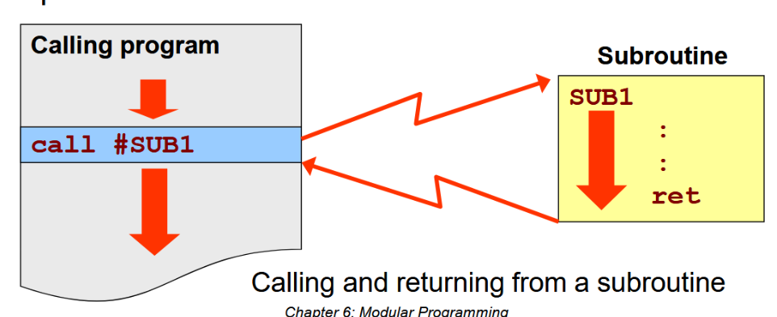
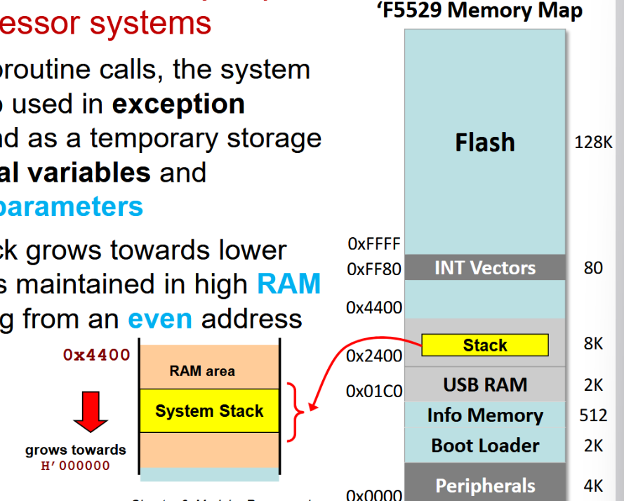
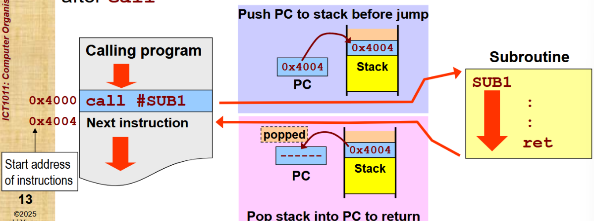
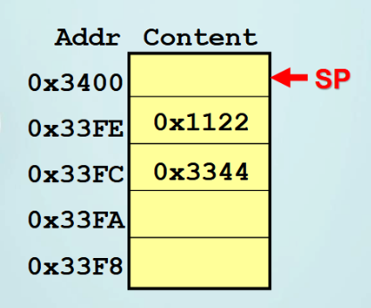
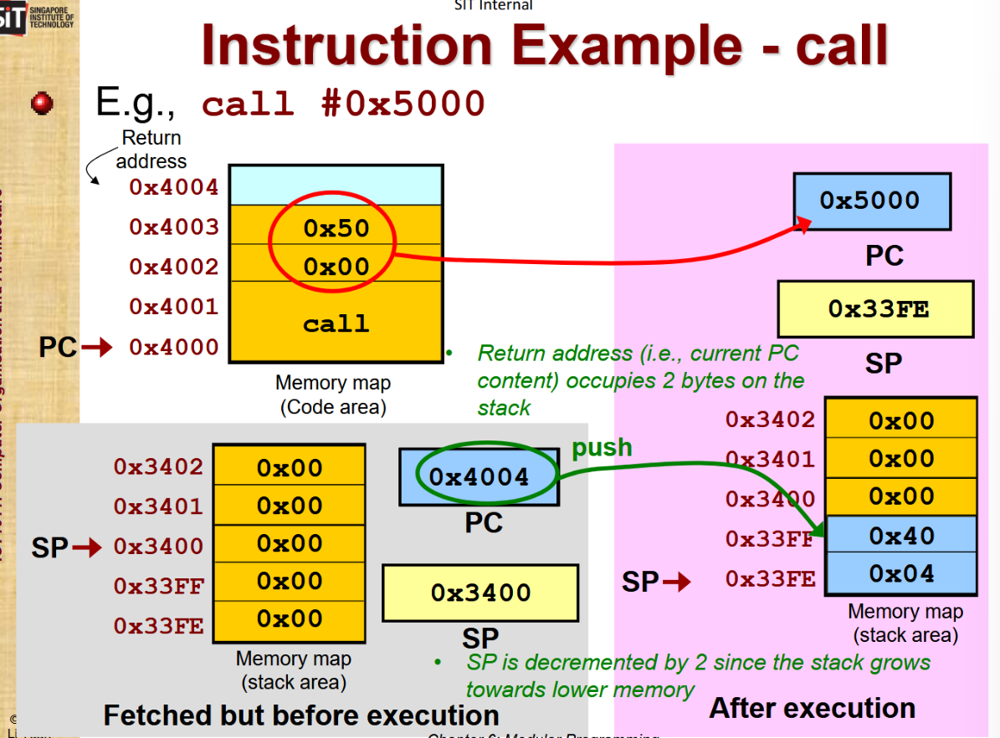
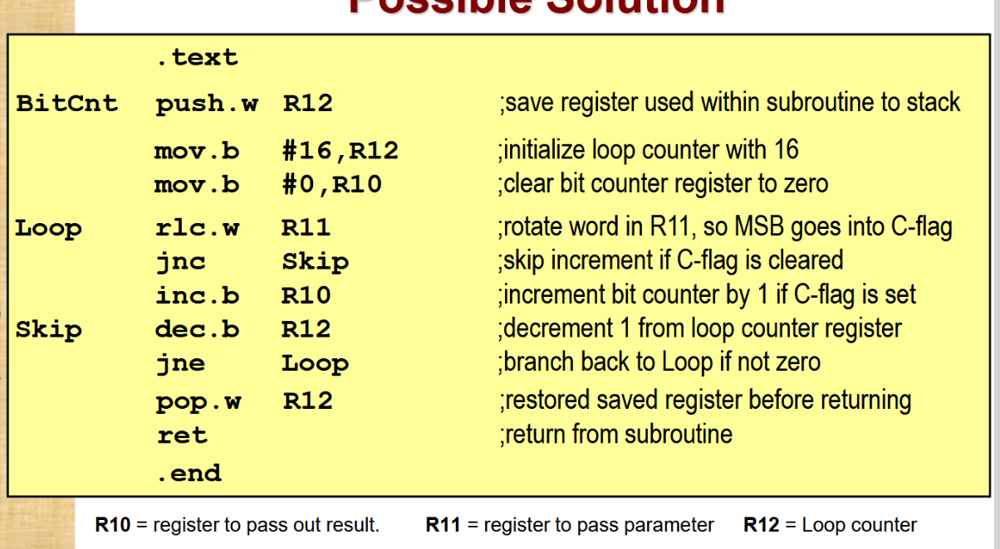
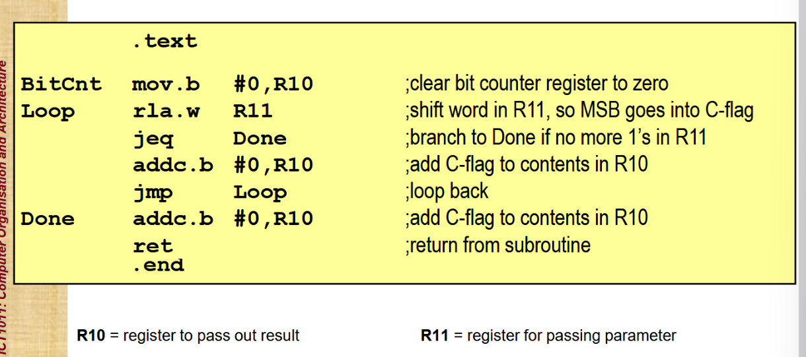
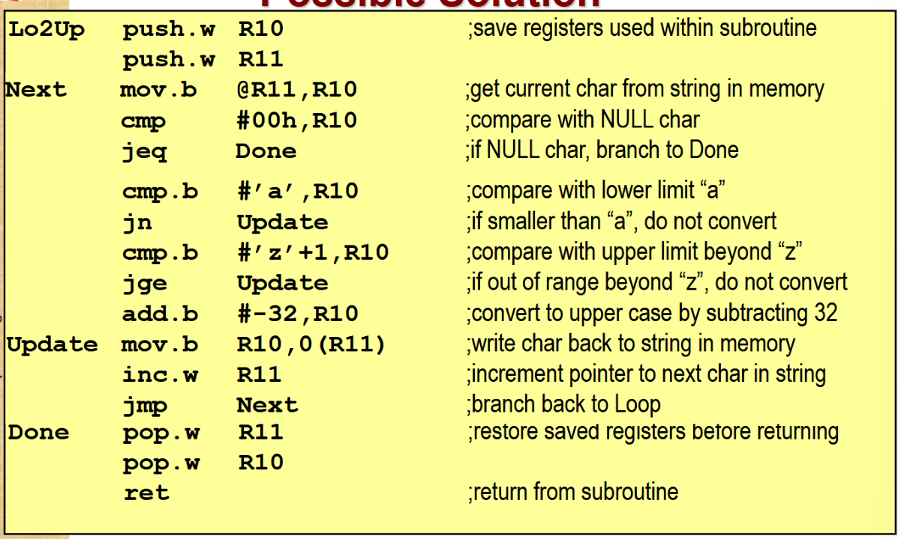
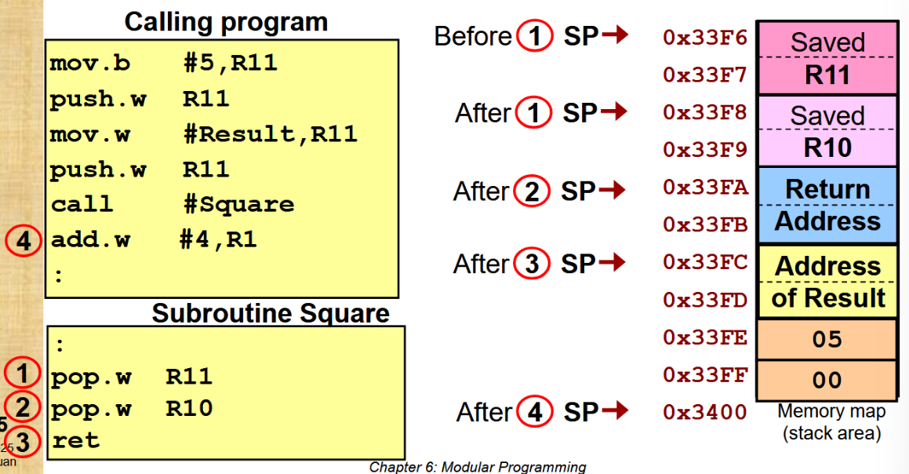
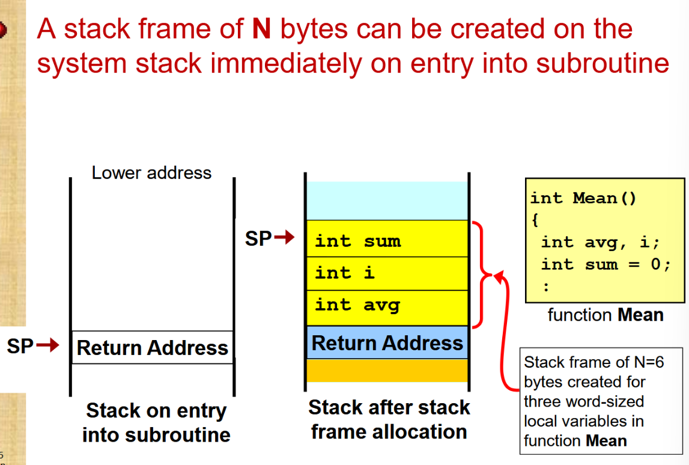

# Modular Program Design
- large, complex software should be decomposed into less complex modules (functions)
- Modules
	- can be designed and tested independently
	- are general can be re-used in other projects
	- can reduce overall program size as the same code segments

- Loose coupling
	- data within modules is entirely independent of other modules
	- strong modularity - should perform a single logically coherent task

# Subroutines
- Modules or functions in C
- Same subroutine can be called from various parts of the program
- Once completed, returns control to the place where the subroutine is called

- `call` and `ret`
	- 
	- a return address is saved on the **system stack** before jumping to the subroutine

Recap: [Stack Pointer](3Instruction%20Set%20Architecture%20&%20Addressing%20Modes.md#R1%20-%20Stack%20Pointer)

# System Stack in the MSP430
- Handle subroutine calls, used in exception handling, temporary storage area for local variables and subroutine parameters
- Since stack grows towards lower memory, maintained in high RAM area
- Starts at 0x4400
	- 

## Subroutines and the System Stack
A return address is saved on the system before jumping to the subroutine
- It is the <font color="#00b0f0">current PC contents</font>, which is the memory address of the next instruction after call
	

Example: 
- 
	- Assume the SP is initialized to 0x3400. The following two 16-bit values are pushed to the stack: 0x1122 and 0x3344. What value will be held in SP?
	- Ans: 0x33FC

# CALL
`call` pushes a return address onto the system stack before jumping to the effective address.
- SP decrement by 2
	- Return address is 4 bytes offset from PC
- System stack grows after every execution of `call`
	- Thus, care must be taken when implementing nested subroutine calls as risk of **stack overflow** may occur

- Make sure that R1 is initialised to a valid address in RAM

## Example: `call #0x5000`


### Before Fetching instructions
###### Memory map (code/instructions area)
|     | Address | Contents |
| --- | ------- | -------- |
|     | 0x4004  |          |
|     | 0x4003  | 0x50     |
|     | 0x4002  | 0x00     |
|     | 0x4001  | call ins |
| PC  | 0x4000  | call ins |

### Fetched Instruction, (Before Execution)
PC Increments to the next instruction: 0x4004
###### Memory Map (Stack area)
|     | Address | Contents |
| --- | ------- | -------- |
|     | 0x3402  | 0x00     |
|     | 0x3401  | 0x00     |
| SP  | 0x3400  | 0x00     |
|     | 0x33FF  | 0x00     |
|     | 0x33FE  | 0x00     |
SP: 0x3400

### After Execution
`call #0x5000`

- SP is decremented by 2: 0x33FE
	- Remember <font color="#00b0f0">pre-decrement</font> for PUSH
###### Memory Map (Stack area)
|     | Address | Contents |
| --- | ------- | -------- |
|     | 0x3402  | 0x00     |
|     | 0x3401  | 0x00     |
|     | 0x3400  | 0x00     |
|     | 0x33FF  | 0x40     |
| SP  | 0x33FE  | 0x04     |

- PC contents is overwritten to 0x5000
	- so that is starts executing instructions at 0x5000 (module/function) 

# RET
`ret` returns from a subroutine by **popping the return address from the stack** into the PC
- return address currently on top of stack is popped as a word and placed into the PC
- <font color="#00b0f0">post-increments</font> SP by 2
- Nesting: any push operations to the stack done in the subroutine, must have appropriate pops before `ret` is executed. Prevent stack overflow

## Example (continue from call)
### Run subroutine until `ret`
PC: 0x50**
###### Memory map (Stack area)
|     | Address | Contents |
| --- | ------- | -------- |
|     | 0x3402  | 0x00     |
|     | 0x3401  | 0x00     |
|     | 0x3400  | 0x00     |
|     | 0x33FF  | 0x40     |
| SP  | 0x33FE  | 0x04     |

### After `ret`
- Firstly, PC update to 0x4004
	- Return back to main program

- SP increment by 2: 0x3400
	- Remember <font color="#00b0f0">post-increment</font> for POP

###### Memory map (Stack area)
|     | Address | Contents |
| --- | ------- | -------- |
|     | 0x3402  | 0x00     |
|     | 0x3401  | 0x00     |
| SP  | 0x3400  | 0x00     |
|     | 0x33FF  | 0x40     |
|     | 0x33FE  | 0x04     |

# Parameter Passing
Calling modules often need to pass parameters
- Must be setup properly before the subroutine is called
- Must be appropriately removed after returning to the calling program

1. Setup params
2. `call #sub1`
3. Remove params (depend on passing method)

3 methods to pass parameters:
- registers
- memory block
- system stack

## Passing using register
- placed in to registers before calling subroutine

Pros
- Efficient, can be used immediately in the subroutine
- Useful when number of params are small
Cons
- Reduce number of available registers
- Lacks generality (limited registers)

### Example:
Write a subroutine to count the number "1" bits in a word
- Return the result as a byte in register R10

How to transfer word param into subroutine?
- Place the word in a register, which can be accessed within the subroutine
How to check if each individual bit is a "1" or a "0"?
- Rotate R11 left 16 times
- After each rotation, test carry bit to decide if the bit counter (R10) should be incremented

One solution:
- 
	- The first instruction `push.w R12` and last 2nd instruction `pop.w R12` are to return the original contents of R12 as it may be used by the calling program

Another solution:
- 
	- Parameter passed into R11 will be destroyed after execution of this subroutine
	- Shows use case for `addc`

## Passing using Memory
- params passed gathered into a **block** at a predefined memory location
- start address of memory block is passed to the subroutine via an address register
- useful for huge number of params
- called "passing by reference"

### Example:
Lower to Upper Case Subroutine
- Write a subroutine to convert an ASCII string from lower to upper case
- String terminated by a NULL character (0x00)
- Start address of the string is passed via R11

Calling program:
```
String .string 'a','p','p','l','e',00h
	:
	:
	mov.w #String,R11 ;Address label 'String' passed into R11
	call #Lo2Up
```

Convert Idea:
- Check the character value is between 'a' and 'z'.
- If so, subtract its value by 32 to make it upper case. (ASCII Table Conversion)

Solution:
- 
	- Transparent subroutine: R10 and R11 restores their original contents, does not affect proper operation of the calling program
	- Program:
		1. Save Registers
		2. Get character from string in memory
		3. If current char is NULL, jump to Done (end of string check)
		4. If current char is smaller than 'a', jump to Update (a to z check)
		5. If current char is bigger then 'z', jump to Update (a to z check)
		6. Subtract 32 from R10 (lower to upper operation)
		7. Update: write char to memory, increment pointer to next char, jump to Next
		8. Done: restore registers, return subroutine

## Passing using Stack
- Most general method of param passing
- Support recursive programming
- Number of params passed can be large, as long as no stack overflow occur
- Params pushed onto stack **must be removed** by the calling program immediately after returning from subroutine

### Example:
Write a subroutine to compute the square of an unsigned 8-bit byte 'X'
- Value of the 8-bit byte is passed to subroutine 
- word result stored in memory location
- all available registers are required by the calling program and cannot be used to pass the required params

We need to:
- Use the stack to pass byte-sized integer value and word-sized address of result to subroutine
- Use indexed addressing to update memory variable within the subroutine

Main Program:
```
Result .word 1
	:
	mov.b #5,R11
	push.w R11
	mov.w #Result,R11
	push.w R11
	
	call #Square
	add.w #4,R1   ;add 4 to pop the 2-word params from the stack
```
- Prevent stack overflow by popping the params immediately after returning

Subroutine Program
```
Square push.w R10 ;save registers
	push.w R11
	
	mov.b 8(SP),R10 ;retrieve byte value from stack
	mov.w 6(SP),R11 ;retrieve variable's address from stack
	
	mov.w #0, 0(R11) ;set result to 0 first
	
sqr add.w 8(SP), 0(R11) ;add the byte, x, into the result
	dec.b R10 ;decrement R10 by 1, the byte value - 1
	jne sqr ; jump if zero flag is not set
	
Done pop.w R11 ;restore registers
	pop.w R10
	
	ret
```
- Indexed addressing can be used to access params on the stack (requires knowledge of all items on the stack)

Stack Pointer Overview:
- 

## Pass by Value vs Pass by Reference
- Value - the value of the data (or variable) is passed to the subroutine

- Reference - the address of the variable is passed to the subroutine
	- Used when the parameter is to be modified by the subroutine
	- Large quantity of data (e.g. array) have to be passed between the subroutine and calling program

# Subroutine Local Variables
Example C Function:
- C function to compute the mean value
```C
int Mean (int *Array, int N)
{
	int avg, i;
    int sum = 0;
    for (i=0; i<N; i++)
        sum = sum + Array[i];
    avg = sum / N;

    return avg;
}
```
- Local variables are required by the function Mean to compute the result

Subroutines often use local variables whose scope and life span exist only during the execution of the subroutine
- memory storage for variables are created on entry into the subroutine and released on exit from subroutine
- system stack is the ideal place to create memory space for temporary variables
	- called the stack frame (block of memory allocated by a subroutine to be used for local variables)

## Stack Frame

Stack Frame
- Accessed using stack pointer
- Created by adding frame size N to SP
- Used as a reference to access local variables
- Appropriate positive displacements from SP is used to access any of the stack frame variables

# Summary
- `call` and `ret` are the basic instructions for implementing subroutines
- The stack is the most favoured method for parameter passing
- Saving and restoring used registers within a subroutine is necessary to make it transparent to the calling program
- Local variables within a subroutine are usually maintained on the system stack
