# Peripherals and I/O Interfaces
**Peripherals** able to attached to and used with a computer, though not an integral part of it.
- A unit or device providing peripheral functions that is connected to the CPU either on the same chip or different chips.

Peripherals connect to a processor in 2 ways:
- Loosely coupled
	- via **external bus** - USB, SCSI, I<sup>2</sup>C, Firewire
	- via a network - Ethernet, ATM, airport (wireless)
	- via a port - serial (RS232), parallel, PS2
- Tightly coupled
	- via fast **internal bus** - graphics & hard-disk controllers

Interfaces are devices or programs that enable a user to communicate with a computer, or for connecting 2 items of hardware or software. Interfacing (process of connecting 2 devices together so that they can exchange information) includes
- physical connections (hardware interface)
- the hardware
- a set of rules / procedures (software, protocols)
- follow some *Standards*

# Interfacing
Digital and Analogue I/O
- An analogue signal is a signal with **continuous voltage levels**, i.e., can take <font color="#00b0f0">any number of values</font>
- Digital signal has 2 values, <font color="#00b050">High or Low</font>
Can be converted between one another
- Analog-to-Digital Converter (ADC)
- Digital-to-Analog Converter (DAC)
	- can be used to control a valve or to regulate speed of a motor
	- Also used to produce sound on speaker

- Most computers have different types of I/O subsystems (peripheral modules)
	- For example:
		- a set of switches (input device) or a set of LEDs or an LCD display (output device) or a printer can be connected to an I/O **parallel port**
		- a keyboard (input device) can be interfaced with processor through a **serial interface**

# Parallel Data Transfer
- 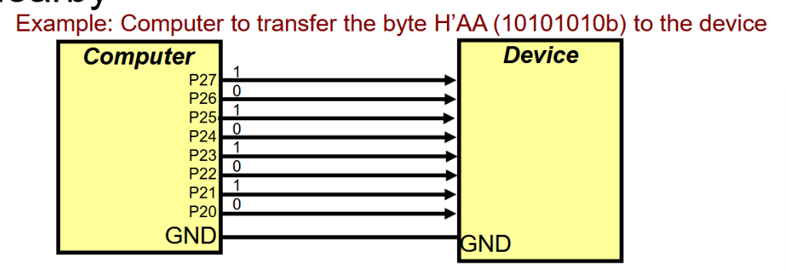
more than 1 bit of information to be transferred between the computer and external device simultaneously
- Fast data transfer
- Usually between processor and devices located nearby

Microcontrollers usually have several parallel ports.
- Cons: 
	- More expensive than serial
		- Uneconomical to use parallel mode as it needs too many wires

# Serial Data Transfer
- 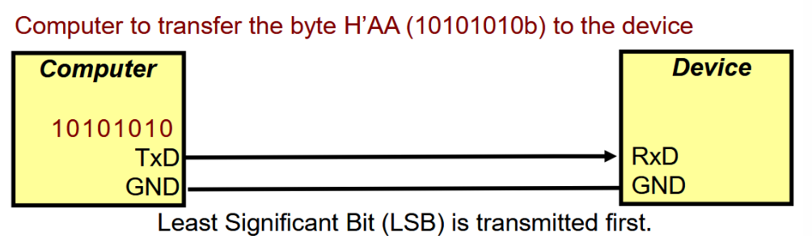
allow 1 bit of data to be transferred at a time through 2/3 wires
- Data can be converted from parallel to serial form to support this type
- Called serial interface
- Less expensive (fewer wires)
- More robust
	- No cross talk (electrical interference between wires)
	- No limitations at high frequencies and long-range transmission
Cons:
- Slower than parallel
	- But latest serial interface (USB 4, 40Gbits/s) is fast for most common applications

Examples:
- Serial communications used for:
	- Communications between the computer and devices that are located far away
	- Keyboard and mouse cables and ports
	- Cables that carry digital video
	- Internal communications in small devices (between processor and peripheral chips) as less connections are required
		- Camera Module <-> Micro-controller <-> Radio Module

# Simplex, Half-duplex, Full-duplex Modes (Data flow Direction)
- Simplex mode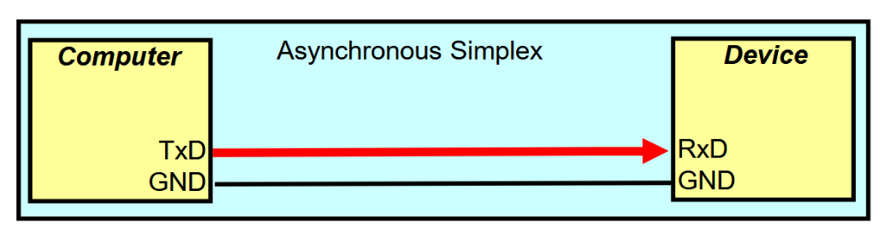
	- Transmission is in <font color="#00b0f0">1 direction only</font>
	- Temperature sensor sending data to a monitoring station
- Half-duplex mode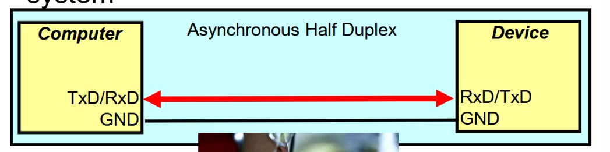
	- Transmission takes place in <font color="#00b0f0">both directions, but 1 at a time</font>
	- a single channel 2-way radio system (walkie talkie)
- Full-duplex mode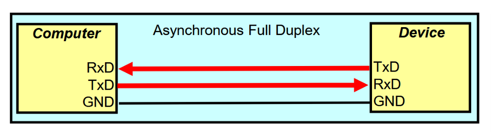
	- Transmission in <font color="#00b0f0">both directions simultaneously</font>
	- Normal telephone line

# Synchronous / Asynchronous (Timing Synchronisation)
- Synchronous transmission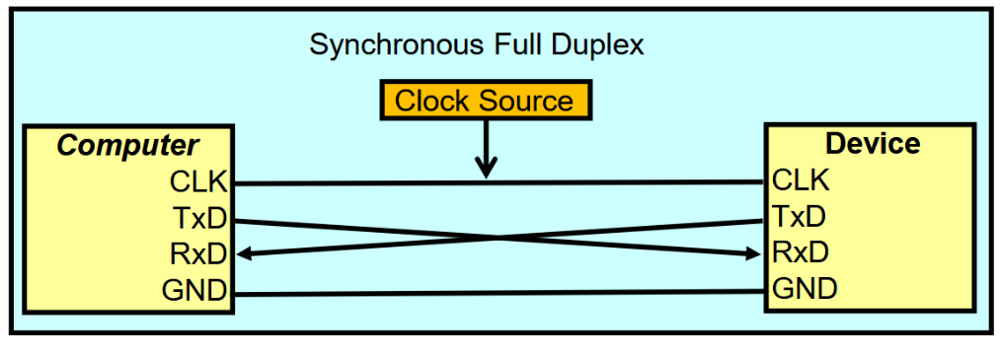
	- A <font color="#00b0f0">common clock</font> is used between transmitter and the receiver to synchronise the bit transfers
- Asynchronous character-based transmission 
	- No common clock
	- Information transmitted 1 bit at a time
		- `[Start Bit] [Data Bits (7-8)] [Parity Bit (Optional)] [Stop Bit(s)]`
		- 1, 1.5 or 2 stop bits

## Asynchronous Character-based Transmission
Parameters must be specified before data communications, includes:
- Baud rate of the transmission
- Number of data bits
- Sense of the optional parity bit
- Number of stop bits
^ Both transmitter and receiver should be configured with the same parameters

Each bit is represented by Mark (logic 1) or Space (logic 0)  
When serial line is idle (no data), it remains in the Mark (logic 1) state

Example:  
Draw the waveform of a 7-bit ASCII character 'C' (B'1000011) transmitted on a serial port with 7-bit data, even parity bit, 1 stop bit and a baud rate of 2400
- 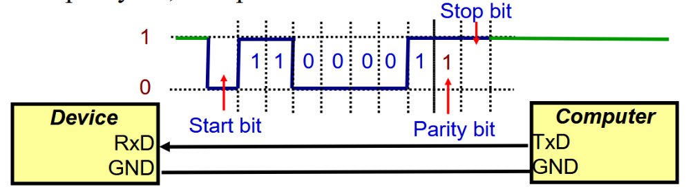
1. The start bit is done by transmitting a Space. 
2. Character C (0x43, 100 0011) is sent 1 bit a time starting from the LSBit 
3. Error detection is achieved through parity bit
	- Even parity bit means total number of 1's in the transmitted frame <font color="#00b0f0">(inclusive of parity bit)</font>, must be **even**
4. Transmitter will transmit 1 or 2 stop bits, they are Mark signals.
	- After stop bit, serial line will be MARK (logic 1) to indicate idle.
5. Baud Rate: maximum number of bits that can be transmitted /s.

### Parity Bit
is to help detect error during transmission

If there is mismatch -> error in transmission
- Parity bit set does not mean error

- Example:
	- Even parity bit: <font color="#00b0f0">Try to make even number of MARK </font>(Logic 1)
		- Data: `1001100` Parity Bit is set `1`, to ensure condition
			- If receiver get the data and parity bit, and <font color="#ff00">mismatch between parity and data exist,</font> it means error in transmission
	- Odd parity bit: <font color="#00b0f0">Try to make odd number of MARK</font> (Logic 1)
		- Data: `1001100` Parity Bit is NOT set `0`, to ensure condition

### Receiver
- Continuously monitors the line looking for the start bit
- Wait till end of start bit to start sampling
- A parity error will occur when the receiver **sample the parity bit and check for parity error**
- Receiver also samples the stop bits for framing error (when Stop bit = Logic 0)

### Baud Rate
- Given by 1/T
	- $T =\text{duration of each bit}$
	- Consider 10 bits per char, Baud rate of 1200 means 120 characters are being transmitted per second
- Common baud rates: 300,600,1200,2400,4800,9600,19200  
- Disadvantage: To transmit 7-bit ASCII, 10-bits are need to be transmitted

### RS-232 Standard
Serial interface standard
- Defines signals connecting between a data terminal equipment (e.g. computer) and a data communication equipment (e.g. modem)
- Specifies electrical and mechanical interface (e.g. voltage levels used, maximum bit rate and maximum distance of operation)

# Memory Mapped I/O and Isolated I/O
Parallel and Serial Communications Port are provided by I/O Ports and Peripheral Modules
- 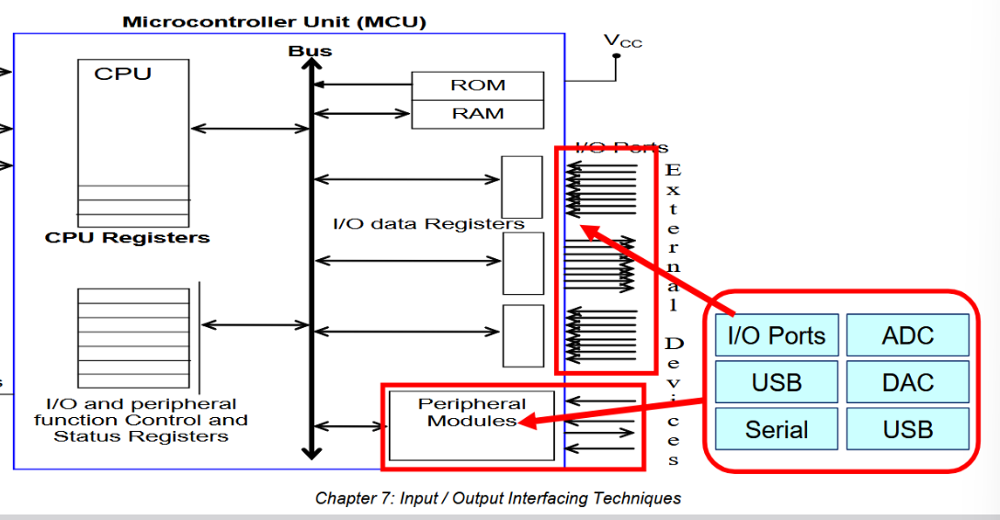

## Peripheral Registers
are provided by the I/O ports and the peripheral modules

It can:
- be configured (asynchronous data format used for serial communications, USCI)
- be used (e.g. to output the value of H'AA to a I/O port)

## Memory Mapped I/O
The peripheral registers are **interfaced onto the same bus as the memory**  
MSP430:
- 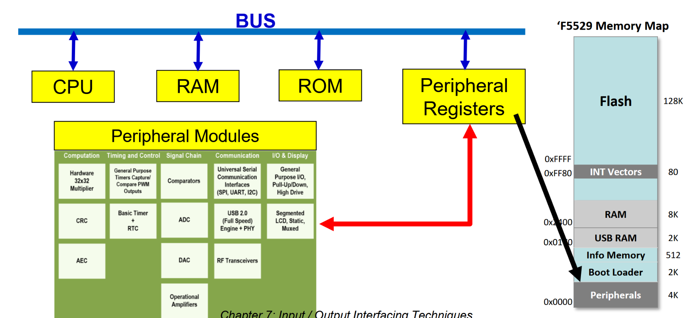
- Share same address space
- Each peripheral register is given an address
- Can be accessed in the same way as any other location in memory

Example (Lab1 MSP430):

| Name of *Port 1* Registers | Description                                                                                                                                                                                                                            |
| -------------------------- | -------------------------------------------------------------------------------------------------------------------------------------------------------------------------------------------------------------------------------------- |
| Direction Register (P1DIR) | The individual bits of P1DIR <font color="#00b0f0">specify input or output</font> for the pins of port 1. Setting a bit to 1 makes the corresponding port 1 pin an output pin, while clearing this bit to 0 makes the pin an input pin |
| Data Out (P1OUT)           | P1OUT<font color="#00b0f0"> stores the output data</font> for the port 1 (For pins configured as output)                                                                                                                               |
| Data In (P1IN)             | P1IN shows port 1 pin states. (i.e. allows <font color="#00b0f0">reading</font> of input pins)                                                                                                                                         |
```
P1DIR .equ 0x0204
P1OUT .equ 0x0202
P1IN .equ 0x0200
	mov.b #0F0h,&P1DIR
	bis.b #080h,&P1OUT
```
1. The first `mov` instruction will set the upper 4 pins as output while the bottom 4 pins will be input
2. `bis` instruction to OR `1000 0000` is to store output data for the first pin which is output
Reading P1IN, will be `1000 0101` which means `0101` is the input from somewhere
- 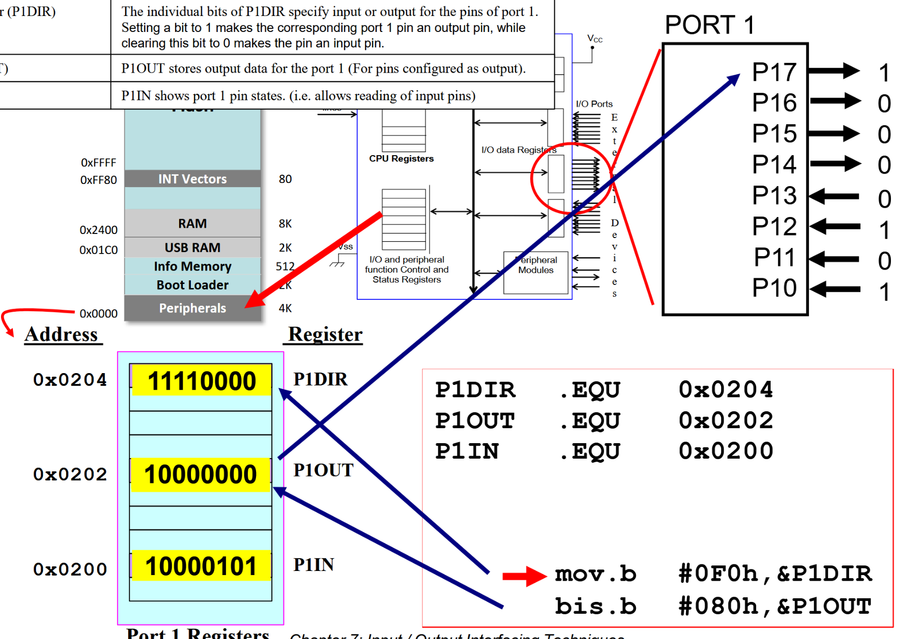
	- Each Port has 8 pins: <font color="#00b0f0">MSB refers to the highest pin</font>

Example:
- Add an XOR operation in the previous code. What values will be present in P1IN? `xor.b #01Fh, &P1OUT`
	- `01FH -> 0001 1111`
	- P1IN will be 1001 0101 because bottom 4 pins are not affected by the xor instruction

## Isolated I/O
2 separate address spaces
- 1 used for memory
- 1 used for I/O devices

- 2 separate control lines for memory and I/O transfer: 
	- I/O read and write 
	- memory read and write

- Separate instructions for data transfer (Different instructions)
	- e.g. `IN` and `OUT` for I/O
		- `MOV` for memory

# Polled and Interrupt-driven I/O Technique
Interfacing involves handling of I/O Data transfer
- Writing (transmitting data to an output device)
- Reading (receiving data from an input device)

2 techniques of data transfer
- Polled I/O (Program controlled, CPU initiated)
- Interrupt Driven (Device initiated)

## Polled I/O Technique
- Polling is continuously testing a port to see if data is a available.
	 - The CPU polls the port if it can read or has written data

- For example, the CPU continuously polls the port to see if printer is ready to accept data
	- if ready, writes a data byte to the printer port, if not, CPU waits

Inefficiency:  
The CPU issues a command to the I/O module, it must wait until the I/O operation is complete
- Printer takes few milliseconds to accept a byte of data, CPU spins in a loop doing nothing
- CPU is faster than the module, and is a waste of processor time

Flow Chart:
- 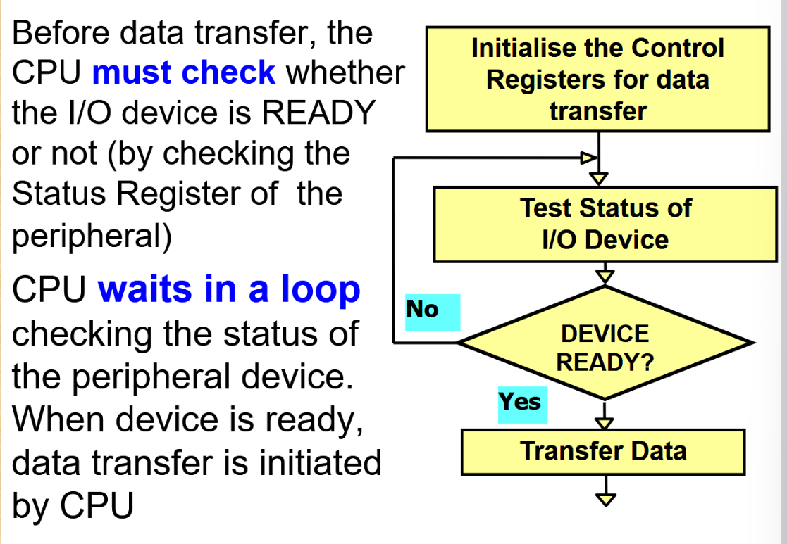


Example(understand the concept):
- 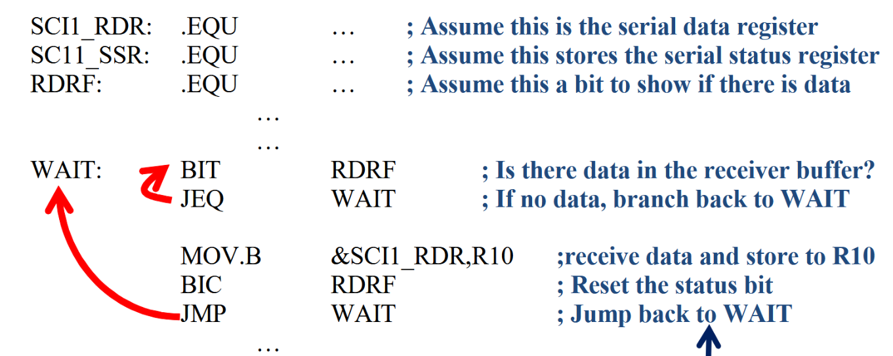
	- RDRF is a bit flag to show whether theres data in the main serial data register
	- -> If there is data, RDRF will be set, stopping the loop, and continuing the transmission
## Interrupt-driven I/O Technique
Initiated by external device

An interrupt is an external hardware event (such as the printer becoming ready to accept another byte)
- Event causes the CPU to suspend the current instruction sequence temporarily
- Execute a special routine written by the programmer called "interrupt service routine" (ISR)

Device is ready for data transfer -> sends an interrupt request to the CPU
- CPU executes an ISR (meant for the device)
- ISR transfers data to/from the device
- ISR short execution, will only suspend the main program for a very brief time

Flow Chart:
- 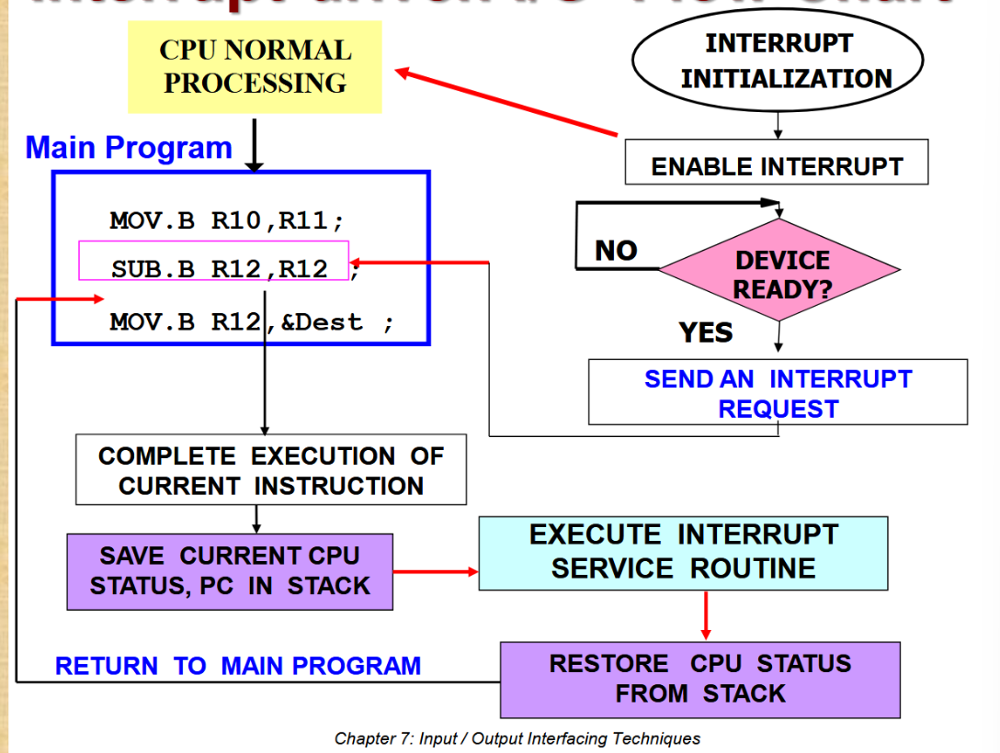
1. Receive Interrupt
2. Complete execution of current instruction first
3. <font color="#00b0f0">Save CPU status (SR) & PC in Stack</font>
4. Execute ISR
5. Restore CPU status from Stack
6. Continue Main program execution

Example: 
- 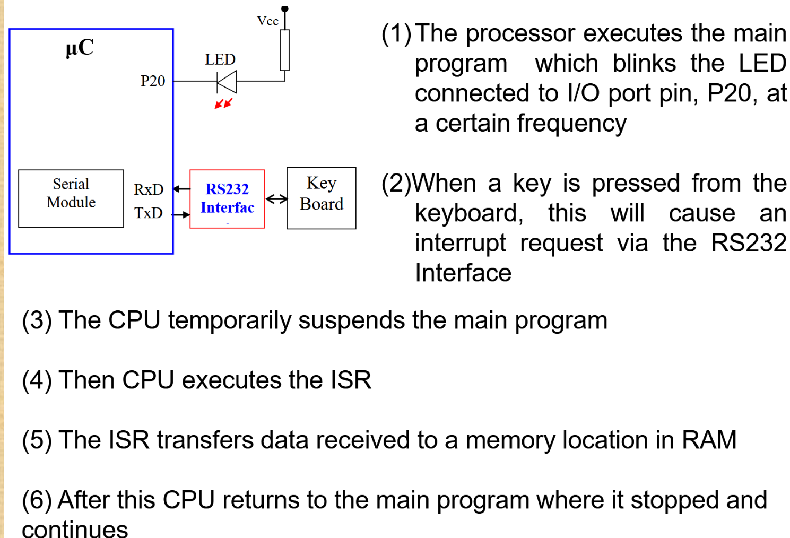

## Pros and Cons
Polled I/O:
- Pros
	- minimum hardware interface circuitry between I/O device and processor
	- programmer has complete control
	- easy to test and debug
- Cons
	- Inefficient use of CPU resources
	- program execution of CPU held up while waiting for I/O device to get ready

Interrupt-driven:
- Pros
	- Efficient use of CPU; only provides service at the request of the peripheral
	- CPU can continue doing other tasks
- Cons
	- more hardware interface circuitry required
	- program is slightly more complex and difficult to debug

## Usage
Polled I/O
- useful when **data transfer must be completed** before the program continues
	- For example:
		- waiting for user input from a mouse
		- writing into control registers of peripheral chips during initialization
		- waiting for a switch

Interrupt-driven I/O
- useful when the timing of the data transfer **cannot be known** beforehand or occurs infrequently
	- For example:
		- getting data from a switch
		- sending data to a printer
		- getting data from a temperature sensor

# Bluetooth
is a short-range radio connection technology.
- Operating frequency: 2402 to 2480 MHz
	- divided into 79 1-Mhz physical channels
- Data rate: 1Mbps (720kbps/user)
- Radio frequency hopping: 625μs slot

## Transmit Power
Class 1:
- 20dBm 
- Output power: 0.1 W
- Range: 100 metres
Class 2: 
- 4dBm
- 2.5mW
- Range: 10 metres
Class 3:
- 0 dBm
- 1 mW
- 1 metre

dBm (decimal-miliwatt) is a power ratio used to measure transmit power

Formula for exchanging Power (watts) and Transmit Power (dBm):
```math
P_{W} = 10^{\frac{P_{dBm}-30}{10}}
```
where $P_{W}$ is watts and $P_{dBm}$ is transmit power in dBm

## Piconets & Scatternets
Piconet:
- Network consists of a set of Bluetooth devices sharing a common channel
	- Max 7 active slave nodes
	- slaves can transmit only when a master requests

Scatternet:
- Interconnected multiple piconets
- <font color="#00b0f0">Master Node can also be a slave node</font>

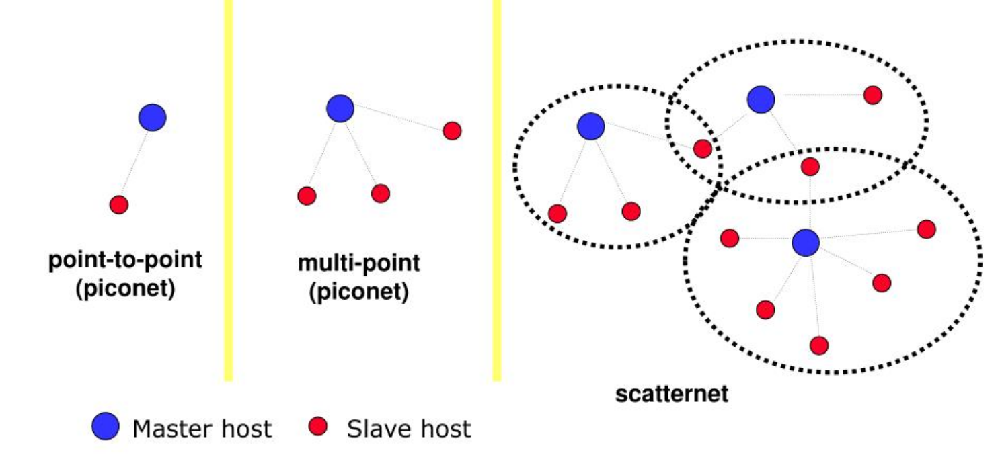

## Frequency Hopping
A method of rapidly changing carrier frequency among many different frequencies over a large spectral band. (For transmission of radio signals)  
Why:
- Makes wireless communication more secure
	- Will require hopping sequence/pattern to intercept communication
- Interference Resistance
	- Reduces impact of narrow-band interference
	- Allow multiple device to share same frequency band

### Bluetooth frequency hopping:
Bandwidth Range (2402 to 2480 MHz) is divided into 79 physical channels of 1 MHz bandwidth each
- 1 MHz is shared among master and active slave(s)
- Frequency hopping will use a random sequence that all devices (master, active and parked slaves) in the piconet will share
	- Hopping Sequence determined by master
	- Masters in different piconets in the same area use different hop sequences (different physical channels)
		- Possible collisions if using same physical channel

Transmission follows:  
- Master -> Slave -> Master -> Slave

Hopping only after:
- The current packet (unit of data transmission) is transmitted completely
- At a transmission slot boundary
	- Each transmission slot is 625 microseconds long
- Following the hopping pattern

**Time Division Duplexing** (TDD)  
Time is divided into alternating transmission and reception periods
- Alternates between sending and receiving data in time-based slots
	- Alternating transmission and reception periods
- Shared on 1 frequency
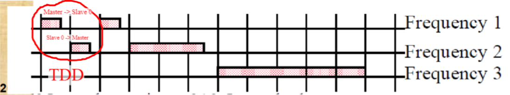

If devices>2 in the piconet, access technique is called:  
**Time Division Multiple Access** (TDMA)
- Each user is allocated specific time slots for transmission
- Multiple users share the same frequency channel


Piconet access is called FH-TDD-TDMA

## Packet Format

| Access Code | Baseband/Link Control Header | Data Payload |
| ----------- | ---------------------------- | ------------ |
| 72 bits     | 54 bits                      | 0-2745 bits  |
Access Code: used for synchronisation and identification of the piconet  
Control Header: 
- active slave address (destination of the packet)
- packet type 
	- Payload type
	- Payload length (whether its 1,2,3 or 5 slots)
- control & error checking bits
Data Payload:
- User data (voice or data)
- Optional payload header

## Bluetooth Operational Status
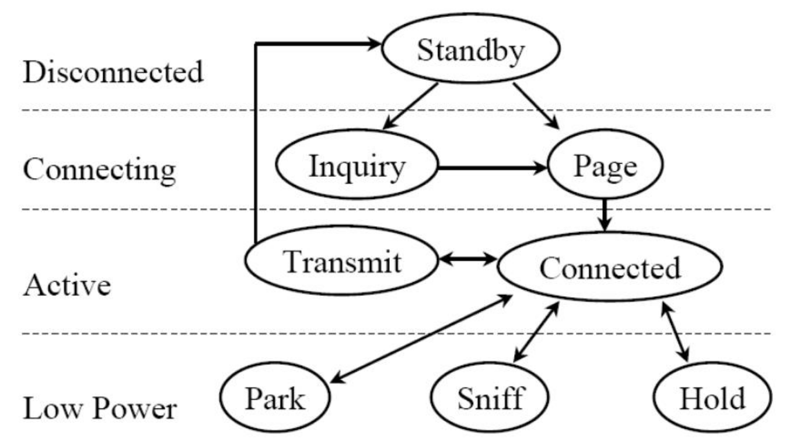

1. Standby
	Initial state
	Disconnected stage
2. Inquiry
	- Master sends inquiry packet
	- Slave devices:
		- Scan for these inquiry packets
		- Respond with their:
		    - Device address
		    - Device clock
		- Respond after a random delay to prevent signal collision
3. Page
	- Master invites devices to join the piconet
	- Paging process:
	    - Master sends page message across 3 consecutive time slots
	    - Slave enters "page response" state
	    - Slave sends back its device access code
	- **Master then provides the slave**:
	    - Its own clock
	    - Its own address
	    - Frequency Hopping Sequence
4. Connected
	The device is connected to a piconet as a master or slave
5. Power down modes
	Hold: 
	- Low power mode
	- Temporarily suspends link between master and slave
		- Specified time duration
		- Can quickly resume communication
	Sniff: 
	- Low power mode
	- Slave listens after fixed sniff intervals
		- Reduces power consumption
		- Maintains potential for communication
	Park:
	- Lowest power mode
	- Device receives:
		- 8-bit parking member address
		- Loses active 3-bit member address
	- Minimal power consumption
	- Remains synchronised with piconet

## Bluetooth LE
Bluetooth Low Energy
- Lower energy, longer battery life
- Used for applications run on battery power for years

Bluetooth Classic:
- Wireless peripherals
- Printers
- Files between devices

Bluetooth LE
- Proximity detectors
- IoT
- Location
- Health devices
- Sensors