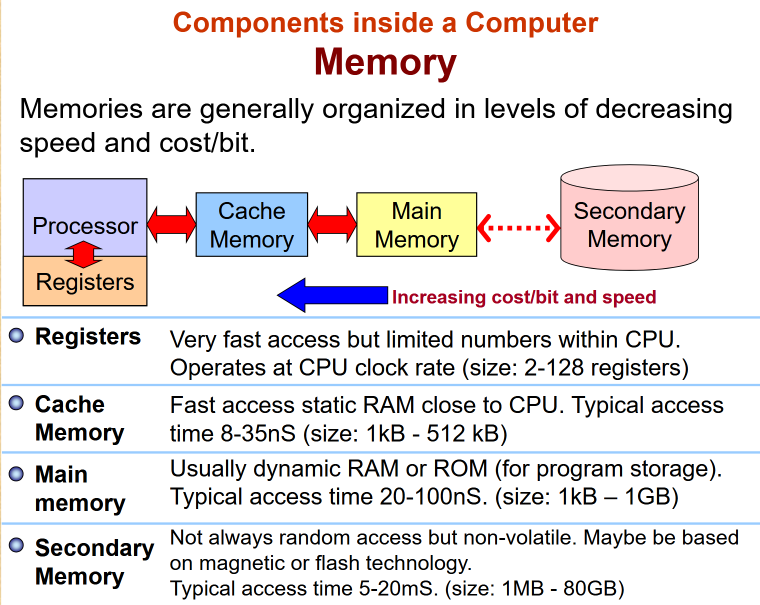
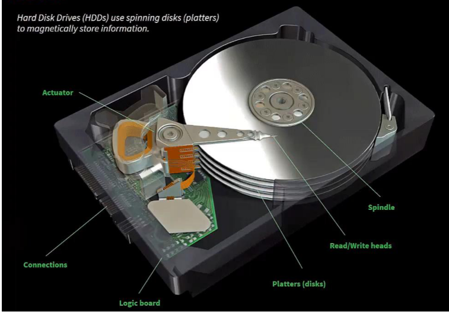
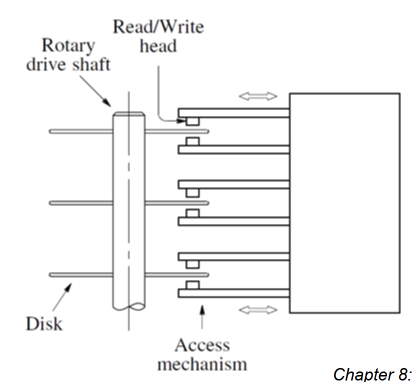
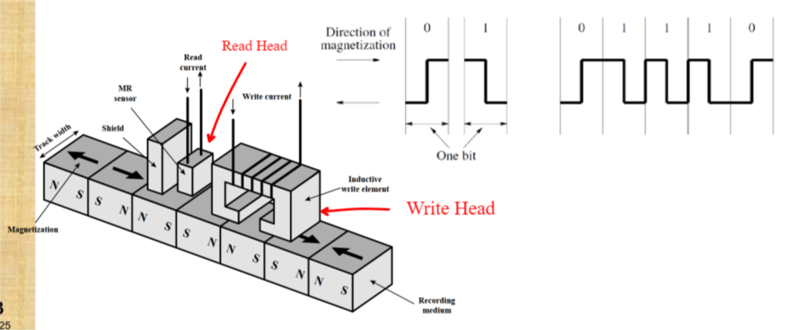
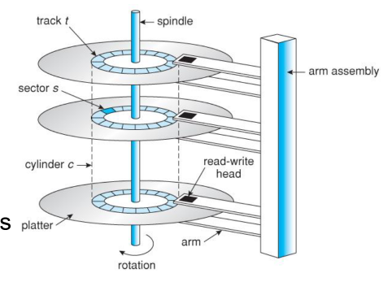
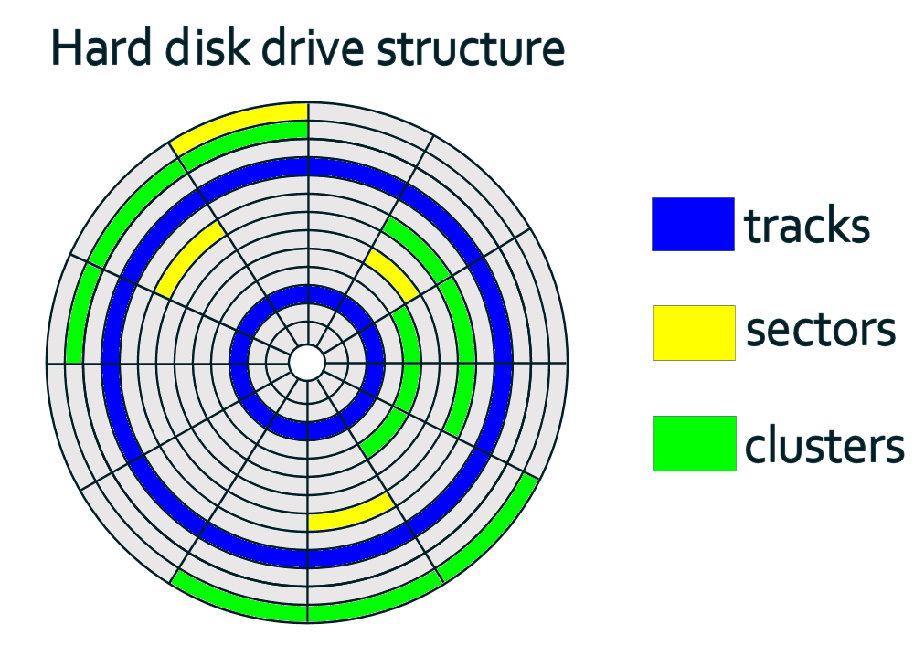
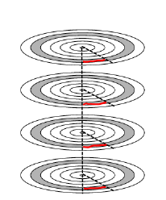
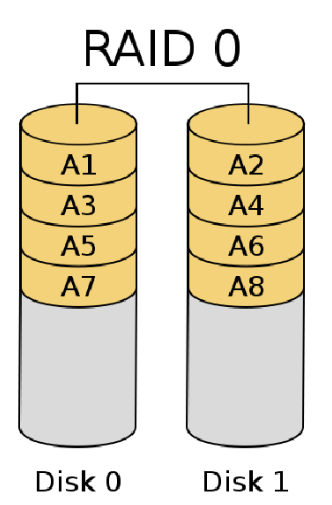
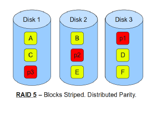
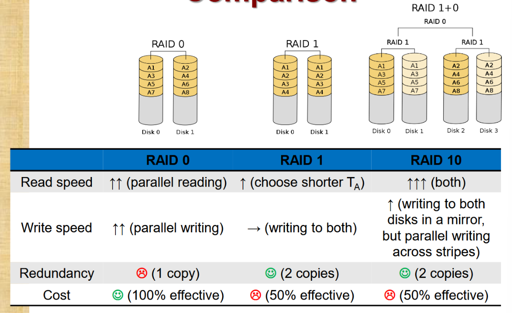

# Memory Hierarchy
[](The%20CPU#Memory)


## Secondary Memory (storage)
- Considered external memory to the microprocessor
- Provides largest storage space for data and program

External Memory consists of
- Peripheral storage devices (accessible to the processor via I/O controllers)

Example types of external secondary memory:
1. Magnetic 
	- Mechanical hard-disk, floppy disk
2. Optical
	- CD-ROM, DVD, BLU-RAY
3. Semiconductor
	- Memory cards, SSDs

# The Magnetic Hard Disk
Large secondary storage. 
```embed
title: "How do hard drives work? - Kanawat Senanan"
image: "https://i.ytimg.com/vi/wteUW2sL7bc/maxresdefault.jpg"
description: "View full lesson: http://ed.ted.com/lessons/how-do-hard-drives-work-kanawat-senananThe modern hard drive is an object that can likely hold more information t..."
url: "https://youtu.be/wteUW2sL7bc?t=31"
favicon: ""
aspectRatio: "56.25"
```

- 
	- 1 or more platters on the common spindle
	- Platters are covered with thin magnetic film
		- 1 platter can have 2 sides of magnetic film
- 
	- Read/Write heads in close proximity to the surface can access data arranged in concentric tracks (arranged with the same centre point)
	- Head are movable (read/write per side)

## Read and Write Mechanisms
  
Recording(Write) and Retrieval(Read) are performed via a conductive coil called a **Head**
- Read/Write Head could be combined, could be separated
- Head is stationary, platter rotates

- Write:
	- Current from wires produce magnetic field (electromagnetism)
		- Will change the direction of the magnetic field of some parts of the film (represents bit 1 or 0)
	- Magnetic pattern recorded on the magnetic film

- Read:
	- Could be separate head
	- Has a magneto resistive sensor that can read
		- Is partially shielded on 1 side
		- Electrical Resistance depends on direction of magnetic field

## Data Organisation and Formatting

- Data stored on the surface of the platter in concentric rings called **Tracks**
	- Each track has same width as the head
	- Gaps between tracks to minimise interferences from adjacent tracks
<font color="#00b0f0">Set of all tracks in the same relative position on the platter is called **Cylinder**</font>

Tracks are divided into **Sectors**
- Sectors may be separated by a small gap to reduce precision requirement
- Minimum **Data Block Size** is <font color="#00b0f0">1 sector</font>

## Multiple Platter Hard Disks
Modern HDD have multiple platters
- Each platter surface will have 1 read/write head that are conjoined, to have the same position for each platter

Advantage:  
Data can be **striped** by cylinder
- Reduces head movement
- Higher transfer rate
	
	- 4 Mbytes data block can be striped into $8\times 512$ Kbytes
	- Disk has 4 double sided platters
	- -> 8 surfaces
	- -> 8 tracks stored on the same location (can be read/write at the same time)

### Example Question:
- A magnetic hard disk comprises 3 platters, and each platter has 2 recording surfaces, where each surface is composed of 6000 tracks. How many cylinders does this disk have, and how many tracks are there in 1 cylinder.
	- 6000 tracks means there are 6000 rings/locations on every surface (visualised)
	- Since each cylinder is a set of tracks that are in the same location -> means there are 6000 cylinders (because 6000 locations)
	- There are 2 recording surfaces $\times$ 3 platters = total 6 surfaces
	- 6 surfaces $\times$ 6000 tracks = 36000 total tracks
	- 36000 tracks $\div$ 6000 cylinders = 6 tracks in 1 cylinder

## Speed (Transfer Rate) of Hard Disk
1. Seek Time (T<sub>s</sub>)
	 - Time for <font color="#00b0f0">Head to move to correct Track</font>
2. Rotational Delay (T<sub>R</sub>)
	- Time for <font color="#00b0f0">Platter to rotate until head reaches starting position of target sector</font>
3. Access Time (T<sub>A</sub> = T<sub>S</sub> + T<sub>R</sub>)
	- Time from request to the time the head is physically in position
4. Transfer Time (T<sub>T</sub>)
	- Time required to <font color="#00b0f0">transfer the requested data</font>

### Rotational Delay (T<sub>R</sub>)
is dependant on the rotational speed of the disk. 
- <font color="#00b0f0">Revolutions Per Minute</font> (RPM)

RPM is usually converted to Revolutions Per Second  
Formula:
$$
\text{RPS} = \frac{\text{RPM}}{60}
$$

$T_{R}$ (in seconds) Formula:
$$
\begin{gathered}
0.5 \div RPS \\
(\frac{1}{2} \times RPM) \div 60
\end{gathered}
$$

Example:  
For a random sector, Average Rotational delay, T<sub>R</sub> = 0.5/RPS seconds -> (0.5 for half a revolution)

### Transfer Time (T<sub>T</sub>)
is dependant on
- RPS
- Track Density (D<sub>T</sub>) 
	- number of sectors per track
- Sector Density (D<sub>S</sub>)
	- number of bytes per sector
- Number of bytes for the transfer (N)

Transfer Time Formula:  
$$  
T_{T} = \frac{N}{RPS\times D_{T}\times D_{S}}  
$$  
$D_{T}\times D_{S}$  = number of bytes on the track  
Number of bytes / speed($\frac{\text{bytes}}{\text{second}}$) = Transfer Time

### Total Time
Total average data block read/write time:  
$$  
T_{total} = T_{S} + T_{R} + T_{T}  
$$  
Total time = Seek time + Rotational time + Transfer time

Example:  
A 15000 RPM disk has the following parameters:
- Average Seek Time, $T_{S} = 4ms$
- Track Density, $D_{T} = 500 \text{ sectors per track}$
- Sector Density, $D_{S} = 512\text{ bytes per sector}$
- Revolutions per Second, $\frac{15000RPM}{60} = 250RPS$
- Calculate the total time it takes to read a 3Kbytes file that is *stored in consecutive sectors on the **same track***?  
	- 3Kbytes = 1024bytes $\times$ 3 = 3072 bytes 
	- Bytes per track = 500 sectors $\times$ 512 bytes = 256000 bytes
	- 250 RPS $\times$ 256000 bytes per track = 64 000 000 bytes per second
	- Transfer Time (T<sub>T</sub>) to transfer 3072 bytes ($\frac{\text{bytes}}{\text{rated speed}}$) = $\frac{3072}{64000000}$ = 0.000048 seconds
	- Rotational Time ($T_{R}$) = $\frac{0.5}{250}$ = 0.002 seconds
	- Seek Time ($T_{S}$) = 4ms = 0.004 seconds
	- Total time = $T_{T}+T_{R}+T_{S} = 0.000048 + 0.002 +0.004 = 0.006048\text{ seconds} = 6.048\text{ ms}$
- Example shows Access Time (physical) is the bottleneck

### Additional considerations when calculating speeds
Track to track access time: time taken to move from 1 track to another  
If data is stored in successive tracks
- Consider inter-track access time
# Redundancy and Surety (Use of RAID)
## Redundant Array of Independent Disks (RAID)
Problems from using 1 single hard disk:
- Access time from moving the head to the correct position
	- Lowers the transfer rate of the disk
- Magnetic hard disk suffers easily from crashes

We can use RAID
- Different RAID Configs (7 levels, 0 to 6)
- Use **data striping** (data distributed across physical drives) to improve access times (some configs)
- Redundant capacity to mirror a drive (some configs)

## RAID 0 (Striping)
- No redundancy
- Needs <font color="#00b0f0">minimum of 2 disks</font>
- Data striped as blocks across all disks
- Round robin striping
- Increased speeds
	- Disks seek in parallel
	- A set of data likely to be striped across multiple disks


## RAID 1 (Mirroring)
- Mirrored Disks
	- Written identically to 2 or more disks
	- 2 copies of each stripe on separate disks
	- <font color="#00b0f0">Minimum 2 disks</font>
- Faster Read times
	- Can read from either disk that contains the data
	- Write time is the <font color="#00b0f0">same</font>
- Recovery
	- Swap faulty disk
	- No down time
- Higher cost

## Nested RAID-Example: RAID 10 (Striped mirroring)
Mirroring and stripping (stripe of mirrors)
- <font color="#00b0f0">Minimum 4 disks</font>
- Half capacity for storage, half for redundancy
- Fast read/write

## RAID 5 (block-level striping & distributed parity)

$$
\begin{gathered}
p_{1} = A \oplus B \\
\text{If A fails: }A=P \oplus B \\
\text{If B fails: }B = P \oplus A
\end{gathered}
$$

## Comparison and applications


Applications:
1. NAS
2. Data streaming
3. Gaming system