# Memory Hierarchy (Register and Cache)
[](The%20CPU#Memory)


Registers:
- Fast flip/flop-based storage elements within the CPU

## Cache Memory:
Fast memory:
- sits between main memory and CPU
- usually small
- optional

Levels of cache:
- L1(fastest), L2, L3

Cache Controller:
1. CPU requests contents of main memory
2. Checks if data is available in cache
	- CPU will then read from cache
3. If not present, cache controller will fetch required block from main memory and store it in cache
4. CPU will then read from cache.

# CPU-Memory Interfacing
[Basic Components of a microcomputer](2The%20CPU.md#Basic%20components%20of%20a%20microcomputer)  
[Impacts of bus widths](2The%20CPU.md#Impacts%20of%20bus%20widths)  
Bus is a communication pathway between 2 or more devices, including CPU, memory, etc.  
A bus is made up of a number of lines/wires/connections that can be classified into 3 functional groups: 
1. Data Bus
	- set of wires, collectively move data
		- Each line can carry 1-bit at a time
		- Number of lines = number of bits that can be transferred at 1 time
2. Address Bus
	- set of wires, to designate the location of data
		- number of lines (address width) = **Maximum possible memory capacity of the system**
3. Control Bus
	- used to control the access and use of the data and address lines
	- support either or both timings:
		- Asynchronous Timing: occurrence of 1 event on the bus will follow/depend on occurrence of another previous event
		- Synchronous Timing: occurrence of events on the bus determined by a clock

Control lines include:
- Memory write / Memory read
- I/O Write, I/O Read
- Interrupt Request / Interrupt Acknowledge
- Clock (for synchronous data transfers)
- Reset

Example:
- 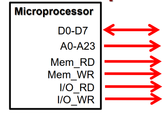
- Pins available on the microprocessor
	- D0-D7 forms the data bus with a width of 8-bits
		- processor can fetch 8 bits at 1 time
	- A0-A23 forms the address with a width of 24-bits
		- Total memory capacity is 2<sup>24</sup> bytes

## Synchronous Bus Transfers - Read
- 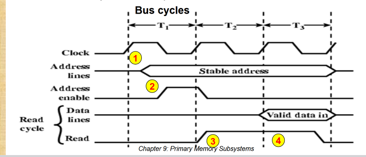
- Follow clock:
	1. Rising edge of $T_{1}$: address enable signal disabled (low voltage)
	2. Rising edge of $T_{2}$: address on the address lines, address enable signal ENABLED
		- Address received by main memory
	3. Rising edge of $T_{3}$: read signal enabled, referenced data sent from main memory module to processor

## Synchronous Bus Transfers - Write
- 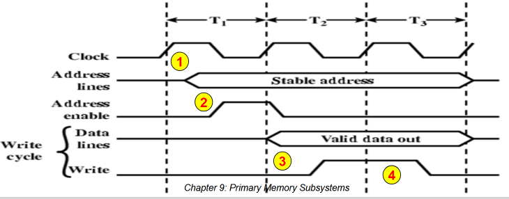
- Follow clock:
	1. Rising edge of $T_{1}$: address enable signal disabled (low voltage)
	2. Rising edge of $T_{2}$: address on address bus, address enable signal enabled
		- Address received by main memory
	3. Rising edge of $T_{3}$: write data on data bus, write signal enabled
		- Data will be sent to main memory and stored specified at the address

## Asynchronous Bus Transfers - Read
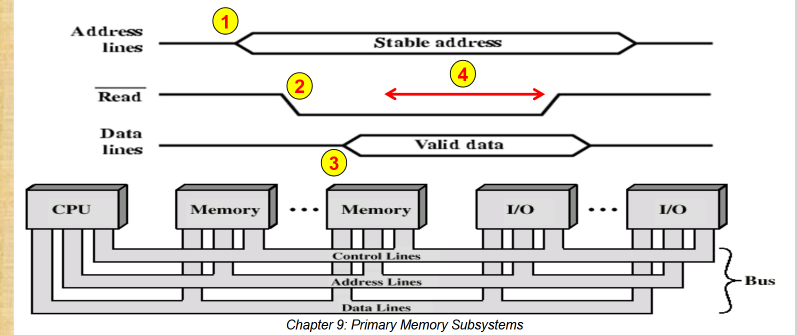
1. Source address is placed on the Address Bus
2. Read Signal activated on the Control Bus
3. After short delay (access time), data stored at the address will be placed on the Data Bus
4. CPU reads data and resets the Address and Control Bus

## Asynchronous Bus Transfers - Write
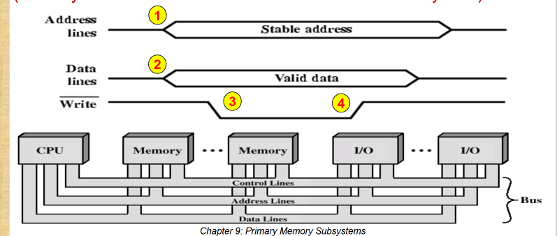
1. Destination address placed on the **address bus**
2. Data stored on the **data bus**
3. Write signal activated on the **control bus**
4. CPU resets the address and control bus after awhile

## Pros and Cons
- Synchronous Timing
	- Simpler to implement and test
	- Less flexible as devices are tied to clock rate
- Asynchronous Timing
	- Very flexible, a mix of slow and fast device (using older and newer technology) can share the same bus
	- Operations of the bus is more complex as different devices operate at different speeds
	- A slow device can hold up the entire bus

## Memory Performance Attributes
### Access Time (latency)
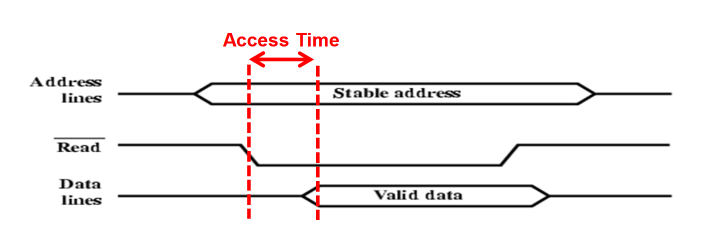
The time from the control request is sent to the memory
- -> to the start time that the data has been stored or made available for use

### Memory cycle time
Access time + any additional time before another memory access can commence

### Transfer Rate
- Rate at which data can be **transferred** in or out of a memory module

RAM:  
```math
\frac{1}{\text{Memory Cycle Time}}
```
Non-RAM (storage):  
```math
TN=TA+\left( \frac{N}{R} \right)
```
- TN = Average time to read or write N bit
- TA = Average Access time (preparation time)
- N = number of bits (bits)
- R = transfer rate in bits per second (b/s)

# Introduction to the Main Memory
Memory is a computer entity that allows a collection of bits to be stored and retrieved.

Main memory is required for the basic operation of a CPU (Fetch-Decode-Execute cycle)  
2 types of memory for main memory:
- RAM: Random Access
- ROM: Read Only

## RAM
- Contents can be read from and written to at any individually.
- Volatile (data retained when power is supplied)
- Computers require RAM to store working variables, temporary data, maintain a system stack
- 2 major types of RAM
	- SRAM: Static RAM (e.g. cache)
	- DRAM: Dynamic RAM

## ROM
- Non-volatile (retained after power-off)
- Not easily changed, but if changed:
	- Contents can be read but normally not written to
- Computers require ROM to store system programs (BIOS), configuration settings

Different types of commonly-used ROM:
- PROM: Programmable ROM (one-time programmable)
- EPROM: Erasable Programmable ROM (erased by UV light)
- EEPROM: Electrically Erasable Programmable ROM (BIOS)
- FLASH (USB Drive, SSD, SD card, etc.)

## Basic Memory Cell
Main memory is constructed with memory cells that support 2 basic operations: READ and WRITE  

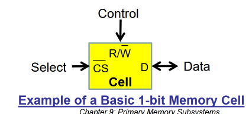  
A basic memory cell has 3 terminals:
- Select: Activates/Selects a cell for reading/writing
- Control: Indicate if a read or write operation is required
- Data: Indicate the data to be stored(Write) or data that has been stored (Read)

### Basic Memory Cell: Write
To write a cell asynchronously, 
- Control signal for writing is activated
- Cell is selected for writing
- Data stored is indicated on the Data terminal
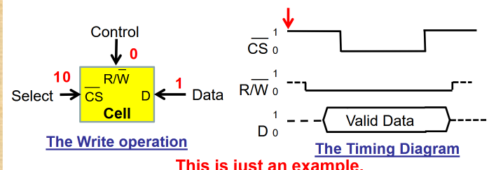

### Basic Memory Cell: Read
To read the content of a cell asynchronously,
- Control signal for reading is activated
- Cell is selected for reading
- Logic stored in the cell is sent to the Data terminal
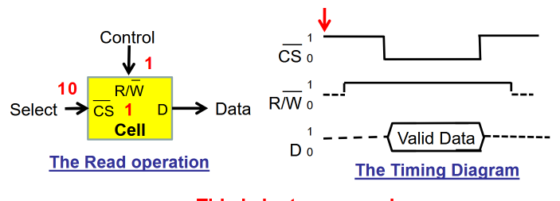

# RAM Technologies
Digital devices (like RAM) are built on transistors.  
Transistor as a simple digital switch with 3 pins:  
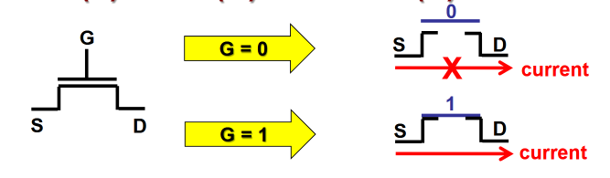
- Source (S), Drain (D), Gate (G)
- When Gate is closed, current is allowed to flow from S to D

## Static RAM (SRAM)
- Volatile (require power to retain data)
- Short access time (few nanoseconds)

```embed
title: "One Memory Bit   SRAM - Georgia Tech - HPCA: Part 4"
image: "https://i.ytimg.com/vi/mwNqzc1o5zM/maxresdefault.jpg?sqp=-oaymwEmCIAKENAF8quKqQMa8AEB-AH-CYAC0AWKAgwIABABGGUgXChBMA8=&rs=AOn4CLDkZDUSNlU26yPYUnr41Hsd0XcdWw"
description: "Watch on Udacity: https://www.udacity.com/course/viewer#!/c-ud007/l-872590120/m-1063529003Check out the full High Performance Computer Architecture course fo..."
url: "https://www.youtube.com/watch?v=mwNqzc1o5zM"
favicon: ""
aspectRatio: "56.25"
```

SRAM cell consists of 2 cross-connected inverters to form a latch
- Chip implementation typically uses CMOS (Complementary Metal-Oxide Semiconductor) cell whose advantage is lower power consumption
- 2 transistors controlled by Word Line act as switches between the cell and the Bit Lines
- 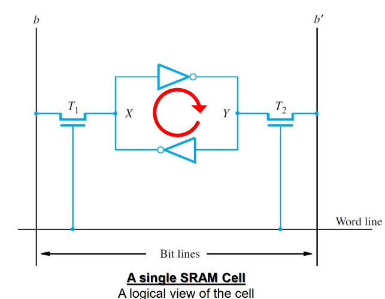
	- To write, the desired bit value is applied to Bit line
	- To read, the bit value is read from Bit line

Example (if cell holds value of 1):  
An inverted consists of 2 transistors (shown in diagram)
- 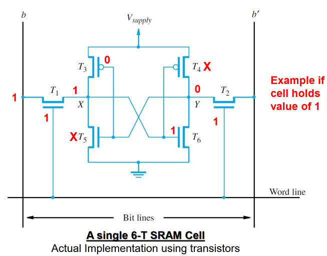

SRAM cells organised in an array:
- 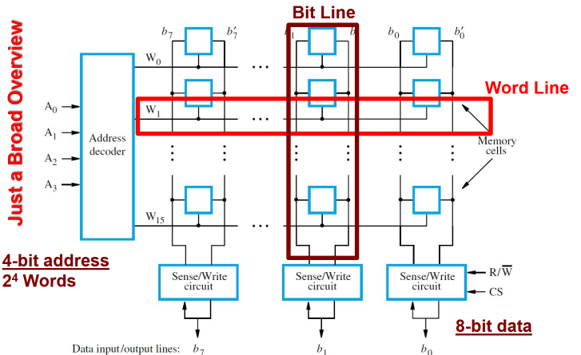

## Dynamic RAM (DRAM)
SRAMs
- have short access time
- require several transistors per cell (more space)
- density is lower (fewer cells per unit chip area)

DRAMs
- have higher density
- lower cost
- longer access time

```embed
title: "One Memory Bit DRAM - Georgia Tech - HPCA: Part 4"
image: "https://i.ytimg.com/vi/3s7zsLU83bY/maxresdefault.jpg?sqp=-oaymwEmCIAKENAF8quKqQMa8AEB-AH-CYAC0AWKAgwIABABGHIgTyg7MA8=&rs=AOn4CLBCG9fONMDkW8svY6bj7FnDZ65c0g"
description: "Watch on Udacity: https://www.udacity.com/course/viewer#!/c-ud007/l-872590120/m-1063529004Check out the full High Performance Computer Architecture course fo..."
url: "https://www.youtube.com/watch?v=3s7zsLU83bY"
favicon: ""
aspectRatio: "56.25"
```

### DRAM Cell
Includes a transistor and a capacitor
- State is present/absent of capacitor charge
	- Capacitors are like tiny batteries that can quickly store and release electricity
- Charge leaks away and must be refreshed (leaky transistors)
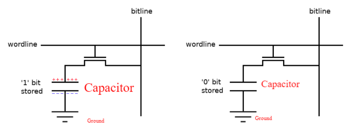

For Write
- Activate word line
	- means transistor is closed
- Set bit line to specific voltage 
	- High voltage: 1, low voltage: 0
- Capacitor is charged or discharged to match the bit line voltage
- Deactivate word line
- Cell is isolated and holds charge

For Read
- Pre-charge bit line to midpoint voltage
- Activate word line
	- means transistor closed
- Stored charge will slightly **lower or raise** the bit line voltage
- amplify bit line voltage
	- Raise = 1, Lower = 0
- Write bit back to DRAM cell because of destructive read behaviour (watch the video)


For Refresh (because capacitors leak energy to the transistor overtime) (so we need to keep writing voltage to it)
- Same operation as Read + 1 more
- Do not send the sensed bit out (not the same as READ operation)

## Pros & Cons
- Both volatile
	-  Power needed to preserve data
DRAM
- Simpler to build (less components)
- Denser
- Less expensive
- Need to be periodically refreshed
- Suitable for main memory (~ GB capacity, separate chip)
SRAM
- Faster access
- Less dense (6T structure)
- Suitable for Cache (~ MB capacity, on CPU chip)

# ROM and FLASH Technologies
ROM has its contents written only once, at the time of manufacture

Basic ROM cell:
- 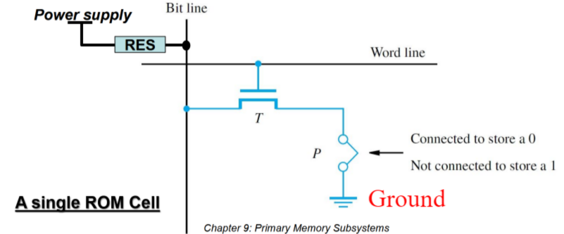
- Contains a single transistor switch for bit line
- Other end of bit line connected to the power supply through a resistor (give voltage)
- If transistor is connected to ground
	- Bit line voltage is near 0, cell stores a 0
- If transistor is not connected
	- Bit line voltage is high for a 1

## PROM, EPROM, EEPROM
Cells of a Programmable ROM (PROM) chip may be written after the time of manufacture
- A fuse is burned out with a high current pulse

An Erasable Programmable ROM (EPROM) uses a special transistor instead of a fuse
- Injecting charge allows transistor to turn on (Logic 0)
- Erasure requires UV light to remove all charge

An Electrically Erasable Programmable ROM (EEPROM) can have individual cells erased electrically
- More expensive than EPROM

## Flash Memory
Flash memory based on EEPROM cells
- Erased in larger blocks of cells (for higher density)
- Write requires: Reading, erasing, writing **entire blocks** with changes
- Greater density
- Lower cost of Flash memory > inconvenience block writes
- Widely used in cell phones, digital cameras, and SSDs